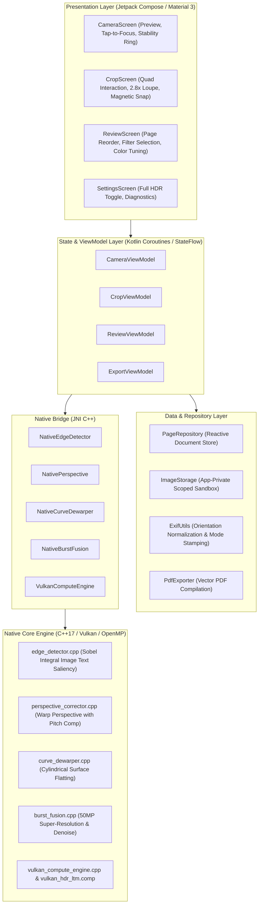

# Specification 00: System Architecture & Technology Stack
## 技术规格书 00：系统架构与技术栈规范

> **Document Status**: Authoritative Architecture Specification  
> **Target Audience**: Core Engineers & Contributors  
> **Languages**: Primary: English / Secondary: Chinese (Bilingual Executive Summaries)

---

## 1. Executive Summary & Design Philosophy / 核心设计理念

HachiCam is a 100% on-device, zero-network-dependency, high-precision document scanner and computational photography application for Android.

### Core Architectural Tenets
1. **Zero Network Permissions & Absolute Privacy (`INTERNET_FREE`)**:
   - `android.permission.INTERNET` is deliberately omitted from `AndroidManifest.xml`. Network egress is physically impossible at the OS kernel permission level.
   - All edge detection, multi-frame homography alignment, GPU HDR tone mapping, adaptive binarization, and PDF generation are executed strictly on the local CPU/GPU.
2. **De-Googled & Open-Source Friendly (Zero GMS Dependency)**:
   - Free from proprietary Google Play Services (e.g. ML Kit Document Scanner, Play Core).
   - Guarantees 100% functionality on AOSP custom distributions (GrapheneOS, CalyxOS, LineageOS) and international markets without Google services.
3. **Deterministic Mathematical Vision vs. Generative Hallucination**:
   - Rather than relying on non-deterministic generative neural networks that risk stroke hallucination on numerical tables, text, or financial receipts, HachiCam builds upon classical computer vision: Retinex illumination decomposition in CIE-Lab, Sauvola integral-image adaptive thresholding, ORB + relaxed RANSAC homography, and Vulkan GPU local tone mapping.

---

## 2. Technology Stack Matrix / 技术栈全景

| Layer / Subsystem | Technology | Version | Purpose & Rationale |
|:---|:---|:---|:---|
| **Operating System** | Android OS | minSdk 29 (Android 10), targetSdk 35 | Modern Scoped Storage and full Camera2 hardware level support |
| **Languages** | Kotlin / C++17 | Kotlin 2.0 / Clang LLVM 17 | Type-safe declarative application layer + bare-metal high-throughput native compute |
| **UI Framework** | Jetpack Compose / Material 3 | Compose 1.7+ (BOM 2024.09) | 60 FPS gesture tracking, reactive touch-to-focus ring, loupe projection |
| **Camera Subsystem** | CameraX + Camera2Interop | CameraX 1.4.1 | Lifecycle management with low-level Camera2 hardware manual parameter overrides |
| **GPU Acceleration** | Vulkan Compute | Vulkan 1.1 / 1.3 SPIR-V | Direct dispatch to Adreno / Mali compute shaders (`vulkan_hdr_ltm.comp`) |
| **Native CV Engine** | OpenCV C++ NDK | OpenCV 4.10.0 (Prefab) | Zero-copy matrix math, NEON SIMD optimizations, OpenMP parallelism |
| **Build Automation** | Gradle / CMake | Gradle 8.14, CMake 3.22.1 | Multi-ABI builds (`arm64-v8a`, `armeabi-v7a`, `x86_64`) with reproducible Git metadata |
| **PDF Generation** | Android Framework `PdfDocument` | Android Core SDK | Lightweight vector document packaging without bloated third-party libraries |
| **EXIF Engine** | AndroidX `ExifInterface` | 1.3.7 | In-place orientation normalization and tamper-evident provenance stamping |

---

## 3. System Architecture & Component Topology / 分层架构拓扑



---

## 4. Subsystem Directory Layout / 源码目录结构

```
android-scan-app/
├── app/
│   ├── src/main/
│   │   ├── cpp/
│   │   │   ├── shaders/
│   │   │   │   ├── vulkan_hdr_ltm.comp        # Vulkan GLSL compute shader
│   │   │   │   └── vulkan_hdr_ltm_spv.h       # Precompiled SPIR-V binary array
│   │   │   ├── edge_detector.cpp              # Canny/Sobel text saliency quad detector
│   │   │   ├── perspective_corrector.cpp      # Homography warp perspective
│   │   │   ├── curve_dewarper.cpp             # Curved book page dewarping
│   │   │   ├── burst_fusion.cpp               # Multi-frame alignment & super-res
│   │   │   ├── vulkan_compute_engine.cpp      # Vulkan runtime engine
│   │   │   └── jni_bridge.cpp                 # JNI method registration
│   │   ├── java/com/scanner/app/
│   │   │   ├── data/camera/FrameAnalyzer.kt   # Preview motion & edge analysis
│   │   │   ├── data/util/ExifUtils.kt         # EXIF rotation & provenance metadata
│   │   │   ├── engine/                        # Kotlin JNI bindings
│   │   │   └── ui/                            # Compose screens & ViewModels
│   │   └── res/                               # Vector assets, strings (EN, ZH, ZH-rCN)
│   └── build.gradle.kts                       # Build configuration & Git stamping
├── specs/                                     # Authoritative technical specifications
│   ├── archive/                               # Preserved legacy iterative specs
│   ├── SPEC_00_ARCHITECTURE.md
│   ├── SPEC_01_CAMERA_AND_CAPTURE_PIPELINE.md
│   ├── SPEC_02_COMPUTATIONAL_PHOTOGRAPHY_AND_VULKAN_HDR.md
│   ├── SPEC_03_DOCUMENT_DETECTION_AND_INTERACTIVE_CROP.md
│   ├── SPEC_04_IMAGE_ENHANCEMENT_AND_GEOMETRY.md
│   └── SPEC_05_HACHIMI_DESIGN_SYSTEM.md
└── build_apk_downloads/                       # Distributed test APK release artifacts
```

---

## 5. Performance Targets & Quality SLAs / 性能指标与服务质量

| Pipeline Stage | Target Latency | Threading / Hardware | Failure Tolerance |
|:---|:---:|:---|:---|
| **Preview Edge Detection** | ≤ 25 ms / frame (40+ FPS) | Background Single Thread (Y-downsampled) | Smooth fallback to inset quad |
| **Full HDR 7-Frame Burst** | ≤ 400 ms total capture | Camera2 hardware direct pipeline | Capture minimum 1 frame if burst aborts |
| **50MP Vulkan HDR Fusion** | ≤ 550 ms | Qualcomm Adreno 752 / Mali GPU Compute | Seamless fallback to CPU OpenMP |
| **CPU OpenMP Fallback** | ≤ 2800 ms | 8-core static scheduling | Complete execution without crash |
| **Filter Processing** | ≤ 45 ms / 12MP | Multi-threaded C++ OpenMP / NEON | Return original image if empty |
| **PDF Page Assembly** | ≤ 30 ms / page | Native Framework `PdfDocument` | Discard bad page without corrupting file |
