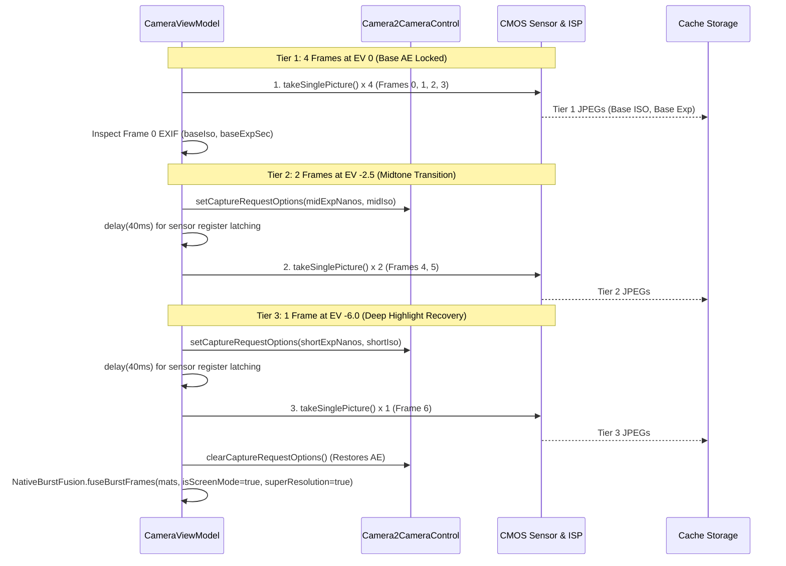

# Specification 01: Camera Subsystem & Capture Pipeline
## 技术规格书 01：相机子系统与拍摄管线规范

> **Document Status**: Authoritative Subsystem Specification  
> **Consolidates**: Legacy SPEC_11 (ISP Tuning), SPEC_14 (EXIF Provenance), and SPEC_16 (Full HDR Pipeline)  
> **Target Audience**: Camera Engineers & Runtime Developers  
> **Languages**: Primary: English / Secondary: Chinese (Bilingual Executive Summaries)

---

## 1. Subsystem Overview / 概述

The camera subsystem coordinates device optical sensors, hardware Image Signal Processors (ISP), Optical Image Stabilization (OIS), and user metering interactions. It exposes two deterministic capture modes:
1. **Normal Mode**: Single-shot low-latency capture with hardware ISP high-quality enhancement and OIS enabled.
2. **Full HDR Unified Mode**: A 7-frame multi-tier exposure pyramid burst (4 EV 0 + 2 EV -2.5 + 1 EV -6.0) capturing high-frequency scene radiance and micro-motion for 50MP super-resolution fusion, highlight recovery, and cinema-grade tone mapping.

---

## 2. Hardware ISP Configuration via Camera2Interop / 硬件 ISP 参数调优

CameraX binds high-level lifecycle use cases (`Preview`, `ImageCapture`, `ImageAnalysis`). To bypass generic vendor down-tuning, low-level Camera2 keys are explicitly injected via `Camera2Interop.Extender`:

```kotlin
val camera2Extender = Camera2Interop.Extender(imageCaptureBuilder)
camera2Extender.setCaptureRequestOption(CaptureRequest.EDGE_MODE, CaptureRequest.EDGE_MODE_HIGH_QUALITY)
camera2Extender.setCaptureRequestOption(CaptureRequest.NOISE_REDUCTION_MODE, CaptureRequest.NOISE_REDUCTION_MODE_HIGH_QUALITY)
camera2Extender.setCaptureRequestOption(CaptureRequest.HOT_PIXEL_MODE, CaptureRequest.HOT_PIXEL_MODE_HIGH_QUALITY)
camera2Extender.setCaptureRequestOption(CaptureRequest.COLOR_CORRECTION_MODE, CaptureRequest.COLOR_CORRECTION_MODE_HIGH_QUALITY)
camera2Extender.setCaptureRequestOption(CaptureRequest.SHADING_MODE, CaptureRequest.SHADING_MODE_HIGH_QUALITY)
camera2Extender.setCaptureRequestOption(CaptureRequest.DISTORTION_CORRECTION_MODE, CaptureRequest.DISTORTION_CORRECTION_MODE_HIGH_QUALITY)
camera2Extender.setCaptureRequestOption(CaptureRequest.COLOR_CORRECTION_ABERRATION_MODE, CaptureRequest.COLOR_CORRECTION_ABERRATION_MODE_HIGH_QUALITY)
camera2Extender.setCaptureRequestOption(CaptureRequest.TONEMAP_MODE, CaptureRequest.TONEMAP_MODE_HIGH_QUALITY)

// Optical stabilization enabled; Electronic video stabilization disabled to prevent warping artifacts
camera2Extender.setCaptureRequestOption(CaptureRequest.LENS_OPTICAL_STABILIZATION_MODE, CaptureRequest.LENS_OPTICAL_STABILIZATION_MODE_ON)
camera2Extender.setCaptureRequestOption(CaptureRequest.CONTROL_VIDEO_STABILIZATION_MODE, CaptureRequest.CONTROL_VIDEO_STABILIZATION_MODE_OFF)
```

---

## 3. Tap-to-Focus & Auto-Exposure Metering (AF / AE) / 点按对焦与测光契约

When the user taps the viewfinder preview:
1. **Metering Point Transformation**:
   The tap offset $(x_{\text{view}}, y_{\text{view}})$ is projected into the sensor coordinate space using `PreviewView.meteringPointFactory.createPoint(x, y)`.
2. **Action Dispatch**:
   A `FocusMeteringAction` is submitted with flags `FLAG_AF or FLAG_AE`, setting an auto-cancel timeout of 3.0 seconds.
3. **Visual Feedback Overlay**:
   A $72 \times 72\,\text{dp}$ square focus ring (1.5 dp solid border with rounded corners) appears immediately at the touch coordinates, animating an entry scale from $1.2\times$ to $1.0\times$ and fading out after 1.5 seconds.

---

## 4. Viewfinder Stability Detection / 取景稳定性检测

To ensure that burst captures occur when hand jitter is minimal:
1. `FrameAnalyzer` evaluates the temporal variance of detected document corner positions across 5 consecutive preview frames:
   $$\sigma_{\text{pos}}^2 = \frac{1}{5} \sum_{i=1}^{5} \|P_i - \bar{P}\|^2$$
2. **Stability State Transition**:
   - If $\sigma_{\text{pos}} < 3.5\,\text{pixels}$, the system transitions to `isStable = true`.
   - The shutter button indicator displays an animated green ring.
3. **Burst Synchronization**:
   When the user initiates a Full HDR capture, the pipeline waits up to 400 ms (`withTimeoutOrNull(400L)`) for `isStable == true` before latching the first frame, ensuring instant tactile responsiveness without shutter lag.

---

## 5. Apple Deep Fusion / Smart HDR 7-Frame Unified Capture Pipeline / 7帧曝光金字塔连拍管线

### 5.1 The Frame Sequence & Exposure Contract
To achieve wide dynamic range and super-resolution without severe exposure cliffs or AE hunting oscillation, the pipeline implements an **Apple Deep Fusion / Smart HDR 7-frame capture pyramid** structured into 3 exposure tiers:

| Frame Range | Tier & Exposure | Camera Control Mode | Exposure Parameter Formula | Functional Purpose |
|:---:|:---:|:---:|:---|:---|
| **Frames 0–3** | **Tier 1 (EV 0 Base)** | Active AE Locked (No 3A reset) | Camera Auto-Exposure (`baseIso`, `baseExpSec`) | Sub-pixel super-resolution anchors, temporal denoise ($1/\sqrt{4}$ SNR boost), geometric reference. |
| **Frames 4–5** | **Tier 2 (EV -2.5 Mid)** | Manual (`CONTROL_AE_MODE_OFF`) | $\text{midIso} = \text{clamp}(\text{baseIso}/4,\ 100,\ 3200)$<br>$\text{midExpSec} = \text{clamp}(\text{baseExpSec}/3,\ 1/2000,\ 1/30)$ | Smooth midtone transition, prevents glare blowout, preserves room and wall illumination tones. |
| **Frame 6** | **Tier 3 (EV -6.0 Short)** | Manual (`CONTROL_AE_MODE_OFF`) | $\text{shortIso} = \text{clamp}(\text{midIso}/8,\ 100,\ 800)$<br>$\text{shortExpSec} = \text{clamp}(\text{midExpSec}/4,\ 1/4000,\ 1/250)$ | Extreme highlight recovery: lamp filaments, lightbulb markings, and specular un-saturation. |

### 5.2 7-Frame Exposure Sequence Diagram


---

## 6. EXIF Provenance & Image Normalization / EXIF 旋转与防伪签名

### 6.1 Fast OpenCV SIMD Rotation
To prevent expensive intermediate Java `Bitmap` re-decoding and re-compression:
1. `ExifInterface` extracts orientation tag (`ORIENTATION_ROTATE_90/180/270`).
2. The fused 50MP native `Mat` is rotated in-place using OpenCV SIMD `Core.rotate`.
3. The rotated image is written directly to disk via `Imgcodecs.imwrite` with JPEG Quality 95.

### 6.2 Tamper-Evident Provenance Stamping
Every saved image is inscribed with hardware and pipeline metadata:
- **`TAG_SOFTWARE`**: `HachiCam v<versionName> (<gitCommit>) [<Mode>]` (e.g. `[Full HDR]`, `[Normal]`).
- **`TAG_USER_COMMENT`**: `HachiCam v<versionName> (Build: <gitCommit>, <buildTime>), Mode: <Mode>`.
- **`TAG_ORIENTATION`**: Normalized strictly to `ORIENTATION_NORMAL` (1).

---

## 7. [v24 REQUIRED] Asynchronous Capture, RAM-First Pending Frames & Storage Policy / 异步拍摄、内存优先待处理帧与存储策略

> Status: **specified, not yet implemented.** Motivated by user observations on v0.1.2-rc0 (Ace3V): (1) after a tap the shutter spinner stays on for a long time; (2) the app's "cache" (actually disk) grows large.

### 7.1 Current behaviour (code reading, `CameraViewModel.captureFullHdrPhoto`)
- `_isCapturing` is set at tap and cleared only after **all** of: 7 `takePicture` calls (each writes a full JPEG file into `context.cacheDir`), two `delay(40)` sensor latches, JPEG decode of all frames, native fusion (≈ 5–6 s for 50 MP in the observed log), JPEG encode (q95) and page creation. The spinner therefore covers capture **and** processing.
- Frames: 0.7–2.5 MB JPEG each; the temporary files are deleted after fusion, but the fused result (`<uuid>.jpg`, tens of MB at 50 MP) and single-shot captures are also written to `cacheDir` and are **never deleted** by the app (only `LogCollector` prunes logs). Android reports `cacheDir` as "cache", and it can be evicted by the system while pages still reference it.
- Frame requests are issued through CameraX `ImageCapture`; CameraX serialises them, so the inter-frame gap is ISP/JPEG-pipeline latency + file write, not an artificial delay (except the two 40 ms latches).

### 7.2 Capture phase vs processing phase
1. **Capture phase** = from tap until the last burst frame has been received. Only this phase shows the busy indicator / disables the shutter. The moment the last frame is in memory: clear AE overrides (`clearManualCaptureOptions`), set `_isCapturing=false`, reset stability, return to live preview; the UI may immediately accept the next tap.
2. **Processing phase** (decode → align → fuse → encode → page) runs on a background worker. The UI shows a lightweight indicator (per-capture thumbnail placeholder with progress/spinner in the page strip, or a "processing N" badge) and **must not** block the camera.
3. **Pages**: a page is inserted into `PageRepository` at the end of the capture phase with `status = PROCESSING` and a thumbnail from the first (reference) frame. On completion the page is updated in place to `READY` with the fused image path. If fusion fails, fall back to the reference frame (as today) and mark `READY`. The review/crop screens must treat `PROCESSING` pages as non-openable (or show the placeholder) until `READY`.
4. **Worker policy**: one fusion at a time (native memory: decoded 50 MP BGR is ≈ 150 MB per frame), FIFO queue. Maximum queued bursts = 3; beyond that the shutter shows "busy" briefly instead of letting memory grow.
5. The 400 ms stability wait of §4 is kept; it is part of the capture phase.

### 7.3 Frame interval ("~10 ms" request)
- The achievable interval is bounded below by the sensor exposure + readout of each frame. The observed Tier 1 exposures are 58 ms at ISO ≈ 18000 in dim scenes, so a 10 ms gap cannot be reached there; in bright scenes (exposure ≤ 10 ms) it may.
- Requirements (best-effort, no new artificial delay): (a) remove avoidable gaps — do not wait for file I/O between requests (frames are delivered in memory, see 7.4); issue the next request as soon as the previous *capture* (not save) completes; (b) set Tier 2/3 manual parameters while the Tier 1 requests are still in flight where CameraX allows it, and reduce the 40 ms latch to the minimum verified on device (log shows whether the first plate after the change actually has the requested exposure); (c) evaluate `CAPTURE_MODE_MINIMIZE_LATENCY` for burst frames against image quality; (d) if CameraX remains the limit, consider Camera2 interop `captureBurst` as a follow-up, not as part of this change.
- Log per frame: request time, image timestamp, exposure, ISO, and the gap to the previous frame, so the real interval can be measured.

### 7.4 RAM-first pending-frame store
1. `ImageCapture.takePicture(executor, OnImageCapturedCallback)` (no file output). On `onCaptureSuccess(image)`: copy the JPEG plane bytes (`image.planes[0].buffer`) into the store and `image.close()` immediately; extract EXIF (ISO, exposure) from the bytes for the log/tier calculation (`ExifInterface(InputStream)`), no temporary file.
2. Store holds **compressed JPEG bytes** (≈ 1–2.5 MB each, ≈ 10–15 MB per 7-frame burst), kept in **direct (off-Java-heap) buffers** or native memory to avoid pressuring the Java heap. Decoded Mats exist only inside the worker for the burst being processed.
3. **Budget**: pending-store capacity = min(96 MB, 1/8 of device memory class) (≈ 6–8 bursts). If a new burst would exceed the budget, the oldest not-yet-started burst is spilled to disk (see 7.5) rather than rejecting the capture.
4. Frames of a burst are tagged `burstId`, `index`, `tier`, `iso`, `exposureNs`, orientation (needed to fuse and to orient output).

### 7.5 Spill to disk only when needed
- Pending bursts are written to `filesDir/pending/<burstId>/` (frames + a small JSON manifest) **only** when: (a) `onStop()` of the camera activity occurs while any burst is unprocessed (the app is leaving the foreground; `onDestroy` and process death have no reliable callback, so `onStop` is the hook), or (b) the RAM budget is exceeded.
- Processing continues from RAM if the process stays alive; when a burst finishes, its `pending/<burstId>` directory (if any) is deleted.
- On next launch (and on `onStart`), scan `filesDir/pending/`; resume unfinished bursts through the same worker, creating `PROCESSING` pages for them. A manifest older than 7 days or with a missing frame is discarded.
- Optional follow-up (not required now): finish the current fusion in a short foreground service so that backgrounding does not stall it.

### 7.6 Disk policy
- Fused photos and single-shot photos live in **`filesDir/scans/`** (via `ImageStorage`), not in `cacheDir`, so the system cannot evict them while pages reference them. `cacheDir` is reserved for true temporaries (logs, thumbnails).
- Cleanup: (a) on app start delete orphaned files in `cacheDir` matching `hdr_*` / `*.jpg` that no page references (leftovers of earlier versions and crashes); (b) when a page is deleted by the user, delete its original and thumbnail; (c) 合成好的图像永久保存在 `filesDir/scans/`，导出或关闭文档后绝不自动删除，始终等待用户手动删除。
- Settings screen: show app storage in two lines — "Photos (kept)" for `filesDir/scans` and "Temporary" for cacheDir + pending — with a "Clear temporary files" button that never touches pages still in use.
- JPEG quality of the fused output stays 95 until a size/quality trade-off is measured; do not change it silently.

### 7.7 Acceptance checks
- Tap → live preview returns in ≈ (sum of exposures + pipeline latency) without waiting for fusion; a second burst can be started while the first is processing; both end up as `READY` pages.
- No JPEG burst files are created in `cacheDir` during capture; `cacheDir` size after N captures stays ≈ constant; `filesDir/scans` grows only by fused photos.
- Backgrounding the app during processing leaves `filesDir/pending/<id>/`; relaunching completes the fusion and removes the directory.
- Log shows per-frame intervals and queue length.
