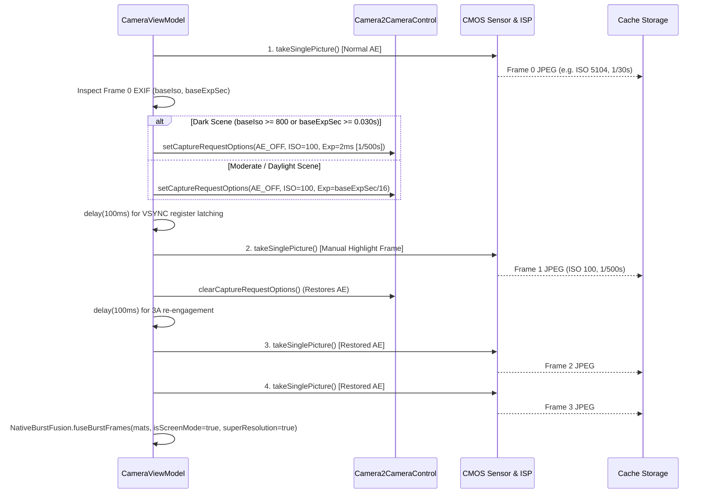

# Specification 01: Camera Subsystem & Capture Pipeline
## 技术规格书 01：相机子系统与拍摄管线规范

> **Document Status**: Authoritative Subsystem Specification  
> **Consolidates**: Legacy SPEC_11 (ISP Tuning), SPEC_14 (EXIF Provenance), and SPEC_16 (Full HDR Pipeline)  
> **Target Audience**: Camera Engineers & Runtime Developers  
> **Languages**: Primary: English / Secondary: Chinese (Bilingual Executive Summaries)

---

## 1. Subsystem Overview / 概述

The camera subsystem coordinates device optical sensors, hardware Image Signal Processors (ISP), Optical Image Stabilization (OIS), and user metering interactions. It exposes two deterministic capture modes:
1. **Normal Mode**: Single-shot low-latency capture with hardware ISP high-quality enhancement and OIS enabled.
2. **Full HDR Unified Mode**: A 4-frame exposure-bracketed and sub-pixel burst capturing high-frequency scene radiance and micro-motion for 50MP super-resolution fusion and tone mapping.

---

## 2. Hardware ISP Configuration via Camera2Interop / 硬件 ISP 参数调优

CameraX binds high-level lifecycle use cases (`Preview`, `ImageCapture`, `ImageAnalysis`). To bypass generic vendor down-tuning, low-level Camera2 keys are explicitly injected via `Camera2Interop.Extender`:

```kotlin
val camera2Extender = Camera2Interop.Extender(imageCaptureBuilder)
camera2Extender.setCaptureRequestOption(CaptureRequest.EDGE_MODE, CaptureRequest.EDGE_MODE_HIGH_QUALITY)
camera2Extender.setCaptureRequestOption(CaptureRequest.NOISE_REDUCTION_MODE, CaptureRequest.NOISE_REDUCTION_MODE_HIGH_QUALITY)
camera2Extender.setCaptureRequestOption(CaptureRequest.HOT_PIXEL_MODE, CaptureRequest.HOT_PIXEL_MODE_HIGH_QUALITY)
camera2Extender.setCaptureRequestOption(CaptureRequest.COLOR_CORRECTION_MODE, CaptureRequest.COLOR_CORRECTION_MODE_HIGH_QUALITY)
camera2Extender.setCaptureRequestOption(CaptureRequest.SHADING_MODE, CaptureRequest.SHADING_MODE_HIGH_QUALITY)
camera2Extender.setCaptureRequestOption(CaptureRequest.DISTORTION_CORRECTION_MODE, CaptureRequest.DISTORTION_CORRECTION_MODE_HIGH_QUALITY)
camera2Extender.setCaptureRequestOption(CaptureRequest.COLOR_CORRECTION_ABERRATION_MODE, CaptureRequest.COLOR_CORRECTION_ABERRATION_MODE_HIGH_QUALITY)
camera2Extender.setCaptureRequestOption(CaptureRequest.TONEMAP_MODE, CaptureRequest.TONEMAP_MODE_HIGH_QUALITY)

// Optical stabilization enabled; Electronic video stabilization disabled to prevent warping artifacts
camera2Extender.setCaptureRequestOption(CaptureRequest.LENS_OPTICAL_STABILIZATION_MODE, CaptureRequest.LENS_OPTICAL_STABILIZATION_MODE_ON)
camera2Extender.setCaptureRequestOption(CaptureRequest.CONTROL_VIDEO_STABILIZATION_MODE, CaptureRequest.CONTROL_VIDEO_STABILIZATION_MODE_OFF)
```

---

## 3. Tap-to-Focus & Auto-Exposure Metering (AF / AE) / 点按对焦与测光契约

When the user taps the viewfinder preview:
1. **Metering Point Transformation**:
   The tap offset $(x_{\text{view}}, y_{\text{view}})$ is projected into the sensor coordinate space using `PreviewView.meteringPointFactory.createPoint(x, y)`.
2. **Action Dispatch**:
   A `FocusMeteringAction` is submitted with flags `FLAG_AF or FLAG_AE`, setting an auto-cancel timeout of 3.0 seconds.
3. **Visual Feedback Overlay**:
   A $72 \times 72\,\text{dp}$ square focus ring (1.5 dp solid border with rounded corners) appears immediately at the touch coordinates, animating an entry scale from $1.2\times$ to $1.0\times$ and fading out after 1.5 seconds.

---

## 4. Viewfinder Stability Detection / 取景稳定性检测

To ensure that burst captures occur when hand jitter is minimal:
1. `FrameAnalyzer` evaluates the temporal variance of detected document corner positions across 5 consecutive preview frames:
   $$\sigma_{\text{pos}}^2 = \frac{1}{5} \sum_{i=1}^{5} \|P_i - \bar{P}\|^2$$
2. **Stability State Transition**:
   - If $\sigma_{\text{pos}} < 3.5\,\text{pixels}$, the system transitions to `isStable = true`.
   - The shutter button indicator displays an animated green ring.
3. **Burst Synchronization**:
   When the user initiates a Full HDR capture, the pipeline waits up to 1500 ms for `isStable == true` before latching the first frame.

---

## 5. Full HDR 4-Frame Unified Capture Pipeline / Full HDR 连拍管线

### 5.1 The Frame Sequence & Exposure Contract
To capture high dynamic range without depending on sluggish or clamped Auto-Exposure (AE) convergence algorithms in dark environments, the pipeline implements **direct hardware sensor manual injection**:

| Frame Index | Capture Mode | Shutter Speed (`SENSOR_EXPOSURE_TIME`) | ISO (`SENSOR_SENSITIVITY`) | Functional Purpose |
|:---:|:---:|:---:|:---:|:---|
| **Frame 0** | Auto-Exposure (AE) | Hardware Metered (e.g. 1/30s) | Hardware Metered (e.g. 5104) | Spatial geometric anchor & dark SNR base |
| **Frame 1** | **Direct Manual** (`CONTROL_AE_MODE_OFF`) | **Mandatory 1/500s (2ms) in dark scenes** | **Mandatory 100 (Base ISO)** | **Extreme highlight un-saturation: desk lamps, bulbs, specular reflections** |
| **Frame 2** | Auto-Exposure (AE) | Restored to Base AE | Restored to Base AE | Sub-pixel phase offset auxiliary 1 (denoise) |
| **Frame 3** | Auto-Exposure (AE) | Restored to Base AE | Restored to Base AE | Sub-pixel phase offset auxiliary 2 (50MP super-res) |

### 5.2 Direct Hardware Exposure Injection Sequence


---

## 6. EXIF Provenance & Image Normalization / EXIF 旋转与防伪签名

### 6.1 Fast OpenCV SIMD Rotation
To prevent expensive intermediate Java `Bitmap` re-decoding and re-compression:
1. `ExifInterface` extracts orientation tag (`ORIENTATION_ROTATE_90/180/270`).
2. The fused 50MP native `Mat` is rotated in-place using OpenCV SIMD `Core.rotate`.
3. The rotated image is written directly to disk via `Imgcodecs.imwrite` with JPEG Quality 95.

### 6.2 Tamper-Evident Provenance Stamping
Every saved image is inscribed with hardware and pipeline metadata:
- **`TAG_SOFTWARE`**: `HachiCam v<versionName> (<gitCommit>) [<Mode>]` (e.g. `[Full HDR]`, `[Normal]`).
- **`TAG_USER_COMMENT`**: `HachiCam v<versionName> (Build: <gitCommit>, <buildTime>), Mode: <Mode>`.
- **`TAG_ORIENTATION`**: Normalized strictly to `ORIENTATION_NORMAL` (1).
