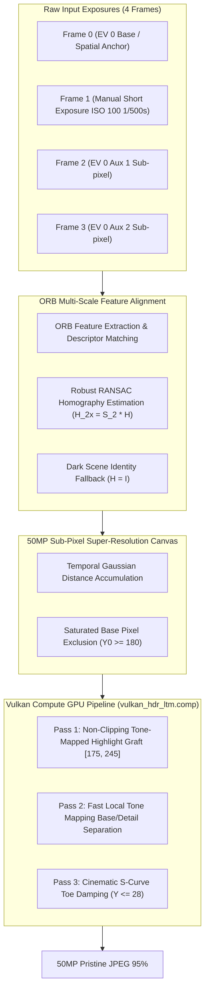

# Specification 02: Computational Photography & Vulkan GPU HDR
## 技术规格书 02：计算摄影与 Vulkan GPU HDR 规范

> **Document Status**: Authoritative Core Pipeline Specification  
> **Consolidates**: Legacy SPEC_04 (Burst Fusion), SPEC_08 (Stability), SPEC_09 (De-ghosting), SPEC_10 (Highlight Grafting), SPEC_12 (Saturation Grafting), SPEC_13 (Tone Mapping), and SPEC_17 (Vulkan GPU Pipeline)  
> **Target Audience**: Computer Vision & Graphics / Compute Engineers  
> **Languages**: Primary: English / Secondary: Chinese (Bilingual Executive Summaries)

---

## 1. Mathematical Architecture Overview / 算法全景

The computational photography engine fuses 4 optical exposures to reconstruct a single high-fidelity, high-dynamic-range ~50MP master image ($8192 \times 6144$).

---

## 2. Multi-Frame Super-Resolution Alignment (50MP) / 多帧亚像素超分对齐

### 2.1 Coordinate Projection to 2× Canvas
To recover optical details beyond the sensor's single-shot Nyquist limit:
1. The base frame is upscaled $2\times$ via bicubic interpolation ($8192 \times 6144$).
2. Homography matrix $H$ is scaled to the $2\times$ super-resolution coordinate system:
   $$H_{2\times} = S_2 \cdot H = \begin{pmatrix} 2.0 & 0.0 & 0.0 \\ 0.0 & 2.0 & 0.0 \\ 0.0 & 0.0 & 1.0 \end{pmatrix} H$$
3. Auxiliary frames are projected to the $2\times$ canvas via `cv::warpPerspective` using bilinear interpolation to preserve sub-pixel phase shifts.

### 2.2 Robust RANSAC Geometry & Dark-Scene Resilience
To eliminate frame rejection in low-light environments with high shot noise:
- **Inlier Count Threshold**: $N_{\text{inliers}} \ge 15$.
- **Inlier Ratio Threshold**: Relaxed from $0.30$ to $\ge 0.10$ ($10\%$).
- **Determinant Consistency Validation**:
  $$\left| \det(H_{2\times 2}) - 1.0 \right| \le 0.40$$
  Guarantees that wild, singular, or non-affine distortions are rejected.
- **Identity Fallback**: If ORB matching fails on Frame 1 in deep darkness, the engine falls back to identity alignment $H = I$ rather than dropping the highlight data.

### 2.3 Saturated Base Pixel Exclusion
To prevent blown-out $255$ pure-white pixels in Frame 0 from polluting and washing out Frame 1 highlight structures during multi-frame averaging:
$$\text{If } Y_0 \ge 180: \quad \text{Skip auxiliary frame accumulation for this pixel.}$$
Only the short-exposure highlight frame is permitted to populate the highlight reconstruction buffer.

---

## 3. Vulkan Compute GPU Pipeline (`vulkan_hdr_ltm.comp`) / GPU 着色器算法

The engine executes in a single compute shader dispatch on Adreno / Mali GPUs with workgroup size $16 \times 16$:

### 3.1 Pass 1: Non-Clipping Tone-Mapped Highlight Reconstruction
Unlike naive physical multiplication that clamps back to pure white ($255$), the engine applies a monotonic tone-mapped highlight reconstruction curve:

1. **Target Highlight Luminance**:
   $$Y_{\text{graft}} = 175.0 + 70.0 \cdot \left(\frac{Y_{\text{short}}}{255.0}\right)^{0.75}$$
   Guarantees that the output luminance remains strictly bounded within $[175.0, 245.0]$, preventing saturation clipping.
2. **Chromaticity Equi-Ratio Scaling**:
   $$C_{\text{graft}} = C_{\text{short}} \cdot \frac{Y_{\text{graft}}}{\max(Y_{\text{short}}, 0.001)}$$
   Color temperature and chromaticity ratios ($R:G:B$) are preserved directly from the short exposure.
3. **Smooth Hermite Transition ($Y_0 \in [180.0, 235.0]$)**:
   $$t = \text{clamp}\left(\frac{Y_0 - 180.0}{235.0 - 180.0}, 0.0, 1.0\right)$$
   $$\alpha = t^2 (3.0 - 2.0 t)$$
   $$C_{\text{final}} = (1.0 - \alpha) \cdot C_{\text{base}} + \alpha \cdot C_{\text{graft}}$$

### 3.2 Pass 2: Fast Local Tone Mapping (LTM) with Highlight Roll-Off
1. **$3 \times 3$ Sliding Window Base/Detail Separation**:
   $$I_{\text{base}}(x, y) = \frac{1}{9} \sum_{dy=-1}^{1} \sum_{dx=-1}^{1} I(x+dx, y+dy)$$
   $$I_{\text{detail}}(x, y) = I(x, y) - I_{\text{base}}(x, y)$$
2. **Logarithmic Illumination Compression**:
   $$I_{\text{base\_comp}} = \frac{\log(1.0 + \mu \cdot (I_{\text{base}} / 255.0))}{\log(1.0 + \mu)} \cdot 255.0, \quad \mu = 8.0$$
3. **Recombination & Highlight Roll-Off**:
   $$I_{\text{ltm}} = \text{clamp}(I_{\text{base\_comp}} + \beta \cdot I_{\text{detail}}, 0, 255), \quad \beta = 1.15$$
   $$w_{\text{ltm}} = \text{clamp}\left(\frac{220.0 - Y}{40.0}, 0.0, 1.0\right)$$
   $$C_{\text{final}} = (1.0 - w_{\text{ltm}}) \cdot C + w_{\text{ltm}} \cdot C_{\text{ltm}}$$
   LTM actively compresses dynamic range and enhances shadow detail for $Y < 180$, while smoothly rolling off to $0.0$ for highlights ($Y \ge 220$), preventing diffuse glare halos.

### 3.3 Pass 3: Cinematic S-Curve Toe Damping
For deep shadows ($Y \le 28.0$):
$$u = \frac{Y}{28.0}, \quad Y_{\text{tone}} = Y \cdot u^{0.65}$$
$$\text{scale} = \frac{Y_{\text{tone}}}{\max(Y, 0.001)}, \quad C_{\text{final}} = \text{clamp}(C \cdot \text{scale}, 0, 255)$$
Eliminates chromatic noise in dark shadows, yielding a pristine, deep black floor.

---

## 4. CPU OpenMP Fallback Engine / CPU 兜底机制

If Vulkan initialization fails or the GPU does not meet Vulkan 1.1 compute requirements:
- The engine executes the exact same mathematical formulation across all CPU cores using OpenMP `#pragma omp parallel for schedule(static)`.
- Pre-computed exponential LUT eliminates millions of transcendental `std::exp()` calls.
- Total processing time on modern 8-core silicon is $\approx 2.8\,\text{s}$, with 100% numerical and visual parity with the GPU pipeline.
