# Specification 02: Computational Photography & Multi-Scale HDR Fusion
## 技术规格书 02：计算摄影与多尺度拉普拉斯 HDR 曝光融合规范

> **Document Status**: Authoritative Core Pipeline Specification  
> **Consolidates**: Legacy SPEC_04 (Burst Fusion), SPEC_08 (Stability), SPEC_09 (De-ghosting), SPEC_10 (Highlight Grafting), SPEC_12 (Saturation Grafting), SPEC_13 (Tone Mapping), SPEC_17 (Vulkan Pipeline), and SPEC_18 (Smart HDR 9-Frame Architecture)  
> **Target Audience**: Computer Vision & Computational Photography Engineers  
> **Languages**: Primary: English / Secondary: Chinese (Bilingual Executive Summaries)

---

## 1. Mathematical Architecture Overview / 算法全景

The computational photography engine implements an **Apple Deep Fusion / Smart HDR 9-Frame Multi-Exposure Pyramid** coupled with **OpenCV `createMergeMertens` Multi-Scale Laplacian Pyramid Fusion** and **Two-Scale Frequency Super-Resolution**:

```mermaid
graph TD
    subgraph Input_Frames ["Raw Input Exposures (9 Frames across 3 Tiers)"]
        T1["Tier 1: Frames 0–3 (EV 0 Base AE / 4-Phase Super-Res)"]
        T2["Tier 2: Frames 4–6 (EV -2.5 Midtone Transition)"]
        T3["Tier 3: Frames 7–8 (EV -5.0 Filament & Deep Highlight)"]
    end

    subgraph Alignment ["ORB Homography & Multi-Phase Alignment"]
        Align1["Tier 1 Alignment to Frame 0 (H_2x = S_2 * H)"]
        Align2["Tier 2 Relative Alignment & Chain Composition (H_k = H_mid0 * H_rel)"]
        Align3["Tier 3 Highlight Alignment with Dark-Scene Fallback (H = I)"]
    end

    subgraph Reconstruction ["Exposure Plate Reconstruction"]
        PlateBase50["50MP Base Plate I_base_50M (Temporal Gaussian Accumulation)"]
        PlateBase12["12MP Base Plate I_base_12M (Area Downsample)"]
        PlateMid12["12MP Midtone Plate I_mid_12M (Temporal Average)"]
        PlateShort12["12MP Short Plate I_short_12M + 50MP Filament ShortSuper"]
    end

    subgraph MertensFusion ["OpenCV MergeMertens Multi-Scale Laplacian Pyramid"]
        Mertens["Laplacian Pyramid Fusion on {I_base_12M, I_mid_12M, I_short_12M}"]
        Upscale["Bicubic Upscale to 50MP Fused Smooth Canvas"]
    end

    subgraph FrequencySplit ["Two-Scale Frequency Detail Re-injection"]
        DetBase["Base High-Freq Detail D_base = I_base_50M - BaseSmooth50M"]
        DetShort["Highlight High-Freq Detail D_short = ShortSuper - ShortSmooth50M"]
        Blend["Highlight Mask Alpha Blending of Details onto Fused Smooth Canvas"]
    end

    subgraph PostProcessing ["Cinema-Grade Color & Texture Refinement"]
        Toe["Cinematic S-Curve Toe Damping (Y <= 28)"]
        Texture["Adaptive Micro-Contrast Texture Synthesis (tau=2, beta=0.55)"]
    end

    Input_Frames --> Alignment
    Alignment --> Reconstruction
    Reconstruction --> MertensFusion
    MertensFusion --> FrequencySplit
    Reconstruction --> FrequencySplit
    FrequencySplit --> PostProcessing
    PostProcessing --> Output["50MP Master Image (Quality 95%, EXIF Full HDR)"]
```

---

## 2. Multi-Frame Exposure Tiers & Alignment / 曝光分层与几何对齐

### 2.1 The Three Exposure Tiers
To prevent single-step exposure cliffs (which cause sensor noise amplification and color distortion):
1. **Tier 1 (Frames 0, 1, 2, 3)**:
   - Exposure: EV 0 (Base Auto-Exposure locked).
   - Captured consecutively without AE interruption.
   - Micro-shifts from natural hand tremor provide the 4 sub-pixel sampling phases.
   - Temporal noise reduction: $1/\sqrt{4} = 50\%$ SNR boost in shadows and midtones.
2. **Tier 2 (Frames 4, 5, 6)**:
   - Exposure: $\approx -2.5$ EV ($\text{midIso} = \text{baseIso}/3$, $\text{midExp} = \text{baseExp}/2$).
   - Captured under manual Camera2 settings (`CONTROL_AE_MODE_OFF`).
   - Smoothly captures the transition between ambient room lighting and direct light source glow.
3. **Tier 3 (Frames 7, 8)**:
   - Exposure: $\approx -5.0$ EV ($\text{shortIso} = 100$, $\text{shortExp} = \text{baseExp}/16$).
   - Completely un-saturates lightbulbs, filaments, and printed lamp labels.

### 2.2 Robust Homography Alignment & Chain Composition
- **Feature Extraction**: ORB (1200 keypoints) downsampled to max dimension 960 for sub-20ms speed.
- **Hamming Cross-Check & RANSAC**:
  - Distance threshold: 3.0 pixels.
  - Inlier threshold: $N_{\text{inliers}} \ge 15$, ratio $\ge 0.10$.
  - Affine determinant check: $|\det(H) - 1.0| \le 0.40$.
- **Chain Composition**:
  - Within Tier 2: $H_{k \to 0} = H_{\text{mid}0} \cdot H_{k \to 4}$.
  - Within Tier 3: $H_{k \to 0} = H_{\text{short}0} \cdot H_{k \to 7}$.
- **Dark Scene Resilience**: If Tier 3 has no ambient features in a dark room, identity fallback $H = I$ is adopted, locking highlight structures without dropping frames.

---

## 3. OpenCV `createMergeMertens` Multi-Scale Fusion / 多尺度拉普拉斯融合

### 3.1 Quality Measure Weighting
For each plate $k \in \{\text{base}, \text{mid}, \text{short}\}$, Mertens computes three per-pixel quality measures:
1. **Contrast Weight ($C_k$)**:
   $$C_k(x, y) = |\nabla^2 I_k(x, y)|$$
   Measures high-frequency local variance and edge sharpness. Flat saturated whites and flat underexposed blacks receive zero weight.
2. **Saturation Weight ($S_k$)**:
   $$S_k(x, y) = \text{std\_dev}(R_k, G_k, B_k)$$
   Preserves rich, vivid color information, preventing washed-out grey tones.
3. **Well-Exposedness Weight ($E_k$)**:
   $$E_k(x, y) = \exp\left(-\frac{(R_k - 0.5)^2}{2\sigma^2}\right) \cdot \exp\left(-\frac{(G_k - 0.5)^2}{2\sigma^2}\right) \cdot \exp\left(-\frac{(B_k - 0.5)^2}{2\sigma^2}\right), \quad \sigma = 0.2$$
   Peaks at midtone luminance ($0.5$), smoothly rolling off to zero near black ($0.0$) and white ($1.0$).

The composite weight map is normalized across all active plates:
$$\hat{W}_k(x, y) = \frac{C_k^{w_c} \cdot S_k^{w_s} \cdot E_k^{w_e}}{\sum_j C_j^{w_c} \cdot S_j^{w_s} \cdot E_j^{w_e}}, \quad w_c = 1.0, w_s = 1.0, w_e = 1.0$$

### 3.2 Laplacian Pyramid Blending
Unlike single-threshold pixel replacement (which causes grey halos or color fringe), Mertens blends images across spatial frequency bands:
1. Construct Gaussian pyramid of weights: $G_l\{\hat{W}_k\}$.
2. Construct Laplacian pyramid of each exposure plate: $L_l\{I_k\}$.
3. Blend at each pyramid level $l$:
   $$L_{\text{fused}, l}(x, y) = \sum_{k} G_l\{\hat{W}_k\}(x, y) \cdot L_l\{I_k\}(x, y)$$
4. Collapse the Laplacian pyramid to reconstruct the artifact-free HDR composite $I_{\text{hdr\_12M}}$.

---

## 4. Two-Scale Frequency Super-Resolution (50MP) / 双尺度高频超分重构

Direct 50MP Laplacian pyramid processing requires $>3.2\,\text{GB}$ of memory allocations. The engine deploys a **Two-Scale Frequency Decomposition**:
1. Run `MergeMertens` on 12MP plates $\to I_{\text{hdr\_12M}}$ ($<150\,\text{MB}$ memory, $\approx 120\,\text{ms}$).
2. Upscale $I_{\text{hdr\_12M}}$ to 50MP ($8160 \times 6144$) via bicubic interpolation $\to I_{\text{fused\_50M\_smooth}}$.
3. Extract high-frequency sub-pixel detail band from the 4-phase accumulation:
   $$D_{\text{base\_50M}} = I_{\text{base\_50M}} - \text{resize}(I_{\text{base\_12M}}, 50\text{MP}, \text{INTER\_CUBIC})$$
4. Extract highlight filament detail band from Tier 3:
   $$D_{\text{short\_50M}} = \text{shortSuper} - \text{resize}(I_{\text{short\_12M}}, 50\text{MP}, \text{INTER\_CUBIC})$$
5. Detail Blending Mask:
   $$\alpha_{\text{highlight}} = \text{clamp}\left(\frac{Y_{\text{hdr}} - 180.0}{60.0}, 0.0, 1.0\right)$$
   $$D_{\text{final}} = (1.0 - \alpha_{\text{highlight}}) \cdot D_{\text{base\_50M}} + \alpha_{\text{highlight}} \cdot D_{\text{short\_50M}}$$
   $$I_{\text{final\_50M}} = \text{clamp}(I_{\text{fused\_50M\_smooth}} + D_{\text{final}}, 0, 255)$$

---

## 5. Post-Refinement Passes / 后处理优化

1. **Cinematic S-Curve Toe Damping ($Y \le 28.0$)**:
   $$u = \frac{Y}{28.0}, \quad Y_{\text{tone}} = Y \cdot u^{0.65}$$
   $$\text{scale} = \frac{Y_{\text{tone}}}{\max(Y, 0.001)}, \quad C_{\text{final}} = \text{clamp}(C \cdot \text{scale}, 0, 255)$$
   Deepens blacks and eliminates dark shadow chromatic noise.
2. **Adaptive Micro-Contrast Texture Synthesis**:
   $$D = Y - Y_{\text{blur}}, \quad \text{if } |D| > 2: \quad \Delta Y = \text{sign}(D) \cdot \min((|D| - 2) \cdot 0.55, 16.0)$$
   $$C_{\text{final}} = \text{clamp}(C + \Delta Y, 0, 255)$$
   Sharpens document ink, text edges, and fine paper textures.
