# Specification 02: Computational Photography & Multi-Scale HDR Fusion
## 技术规格书 02：计算摄影与多尺度拉普拉斯 HDR 曝光融合规范

> **Document Status**: Authoritative Core Pipeline Specification  
> **Implementation Status**: v19 deployed (`versionCode=19`, commit `88f1a05`, branch `gpu-hdr`); v20 active (Screen Direct 50MP Super-Res, Signed Frequency Reconstruction, and Adaptive Acutance Synthesis)  
> **Consolidates**: Legacy SPEC_04 (Burst Fusion), SPEC_08 (Stability), SPEC_09 (De-ghosting), SPEC_10 (Highlight Grafting), SPEC_12 (Saturation Grafting), SPEC_13 (Tone Mapping), SPEC_17 (Vulkan Pipeline), SPEC_18 (Smart HDR 9-Frame Architecture), and SPEC_REF_OEM_RAW_HDR_AND_DENSE_ALIGNMENT (OEM Forensics & Edge Dominance)  
> **Target Audience**: Computer Vision & Computational Photography Engineers  
> **Languages**: Primary: English / Secondary: Chinese (Bilingual Executive Summaries)

---

## 1. Mathematical Architecture Overview / 算法全景

The computational photography engine implements an **Apple Deep Fusion / Smart HDR 7-Frame Multi-Exposure Pyramid** coupled with **OpenCV `createMergeMertens` Multi-Scale Laplacian Pyramid Fusion**, **Reference-Frame Dominant Edge Blending**, **Signed Two-Scale Frequency Reconstruction**, and **Adaptive Acutance Synthesis**:

```mermaid
graph TD
    subgraph Input_Frames ["Raw Input Exposures (7 Frames across 3 Tiers)"]
        T1["Tier 1: Frames 0–3 (EV 0 Base AE / 4-Phase Super-Res)"]
        T2["Tier 2: Frames 4–5 (EV -2.5 Midtone Transition)"]
        T3["Tier 3: Frame 6 (EV -6.0 Filament & Deep Highlight)"]
    end

    subgraph Alignment ["ORB Homography & Multi-Phase Alignment (v16–v19)"]
        Align1["Tier 1 Alignment to Frame 0 (H_2x = S_2 * H)"]
        Align2["Tier 2 Relative Alignment & Chain Composition (H_k = H_mid0 * H_rel)"]
        Align3["Tier 3 Multi-ROI RANSAC Rigid Affine (Multi-Peak Light Source Matching)"]
        ClampGuard["[v19] Periodic Line-Pitch Clamping: transDist <= 8.0px, |ty| <= 6.0px (Zero False Locks)"]
    end

    subgraph Reconstruction ["Exposure Plate Reconstruction"]
        PlateBase50["50MP Base Plate I_base_50M (Reference-Frame Dominant Edge Blending, v19)"]
        PlateBase12["12MP Base Plate I_base_12M (Area Downsample)"]
        PlateMid12["12MP Midtone Plate I_mid_12M (Temporal Average)"]
        PlateShort12["12MP Short Plate I_short_12M + 50MP Filament ShortSuper"]
    end

    subgraph MertensFusion ["OpenCV MergeMertens Multi-Scale Laplacian Pyramid"]
        Mertens["Laplacian Pyramid Fusion on {I_base_12M, I_mid_12M, I_short_12M}"]
        Upscale["Bicubic Upscale to 50MP Fused Smooth Canvas"]
        ScreenGate["[v19] Screen SDR Mode Gating: Bypasses Mertens on Low-DR Screens"]
    end

    subgraph FrequencySplit ["Two-Scale Frequency Detail Re-injection"]
        DetBase["Base High-Freq Detail D_base = I_base_50M - BaseSmooth50M"]
        DetShort["Highlight High-Freq Detail D_short = ShortSuper - ShortSmooth50M"]
        Blend["Highlight Mask Alpha Blending of Details onto Fused Smooth Canvas"]
    end

    subgraph PostProcessing ["Cinema-Grade Color & Texture Refinement"]
        Toe["Cinematic S-Curve Toe Damping (Y <= 28)"]
        ISP["[v17] YCrCb ISP Denoising: Chroma Gaussian σ=3 + Luma Bilateral + Edge-Likelihood Coring Mask"]
    end

    Input_Frames --> Alignment
    Alignment --> Reconstruction
    Reconstruction --> MertensFusion
    MertensFusion --> FrequencySplit
    Reconstruction --> FrequencySplit
    FrequencySplit --> PostProcessing
    PostProcessing --> Output["50MP Master Image (Quality 95%, EXIF Full HDR)"]
```

---

## 2. Multi-Frame Exposure Tiers & Alignment / 曝光分层与几何对齐

### 2.1 The Three Exposure Tiers
To prevent single-step exposure cliffs (which cause sensor noise amplification and color distortion):
1. **Tier 1 (Frames 0, 1, 2, 3)**:
   - Exposure: EV 0 (Base Auto-Exposure locked, `baseIso` up to 17984, `baseExpSec` ≈ 58 ms).
   - Captured consecutively without AE interruption.
   - Micro-shifts from natural hand tremor provide the 4 sub-pixel sampling phases.
   - Temporal noise reduction: $1/\sqrt{4} = 50\%$ SNR boost in shadows and midtones.
2. **Tier 2 (Frames 4, 5)**:
   - Exposure: $\approx -2.5$ EV ($\text{midIso} = \text{clamp}(\text{baseIso}/4,\ 100,\ 3200)$, $\text{midExpSec} = \text{clamp}(\text{baseExpSec}/3,\ 1/2000,\ 1/30)$).
   - Captured under manual Camera2 settings (`CONTROL_AE_MODE_OFF`), with 40 ms sensor register latch delay per tier switch.
   - Smoothly captures the transition between ambient room lighting and direct light source glow.
3. **Tier 3 (Frame 6)**:
   - Exposure: $\approx -6.0$ EV ($\text{shortIso} = \text{clamp}(\text{midIso}/8,\ 100,\ 800)$, $\text{shortExpSec} = \text{clamp}(\text{midExpSec}/4,\ 1/4000,\ 1/250)$).
   - Completely un-saturates lightbulbs, filaments, and printed lamp labels.

**Timing & Performance (v15+, OnePlus 13T, Snapdragon 8 Elite):**
- Inter-tier sensor latch delay: **40 ms** per tier switch (`delay(40)` in `CameraViewModel`).
- Total capture sequence (7 frames across 3 tiers): **~400 ms** (down from ~800 ms in earlier 9-frame design).
- End-to-end shutter-to-final-image latency: **~5.39 s** (including C++ fusion, JPEG encode, EXIF write).

### 2.2 Robust Homography Alignment & Chain Composition
#### 2.2.1 Tier 1 & 2: ORB Feature-Based Homography
- **Feature Extraction**: ORB (1200 keypoints) downsampled to max dimension 960 for sub-20 ms speed.
- **Hamming Cross-Check & RANSAC**:
  - Distance threshold: 3.0 pixels.
  - Inlier threshold: $N_{\text{inliers}} \ge 15$, ratio $\ge 0.10$.
  - Affine determinant check: $|\det(H) - 1.0| \le 0.40$.
- **Chain Composition**:
  - Within Tier 2: $H_{k \to 0} = H_{\text{mid}0} \cdot H_{k \to 4}$.
  - Tier 3 (via Tier 2 bridge): $H_{k \to 0} = H_{\text{short}0} \cdot H_{k \to 6}$.

#### 2.2.2 Tier 3: Multi-ROI RANSAC Rigid Affine Highlight Alignment (v16, `alignHighlightTemplate`)

> **Background**: In a dark room, Tier 3 frames lack ambient scene features for ORB. The engine aligns on the only high-contrast structures present: the light sources themselves (bulbs, lamp filaments).

**Algorithm (`burst_fusion.cpp` L.218–L.449):**

1. **Highlight ROI Extraction**: Downsample 1/4×. Threshold $Y > 200$. `connectedComponentsWithStats` → components with area > 15 px.
2. **Non-Maximum Suppression (NMS)**: Score = `mean_Y × sqrt(area)`. Suppress centroids within 40 px of a higher-scored peer. Retain top-8 light sources.
3. **Per-Source NCC Sub-pixel Matching**: For each source centroid, extract 32×32 px patch from reference frame. `matchTemplate(TM_CCOEFF_NORMED)`. Accept if score ≥ 0.45; record sub-pixel displacement.
4. **RANSAC Rigid Affine Fitting**:
   - $N \ge 3$ matches: `estimateAffinePartial2D` RANSAC → 4-DOF rigid body: $(t_x, t_y, s, \theta)$.
   - Physical self-check: $s \in [0.95, 1.05]$, $|\theta| < 5°$, $\|\mathbf{t}\| \le 45$ px (1/4-scale).
   - $N = 1$: degenerate to pure translation from highest-confidence match.
   - $N = 0$: identity fallback $H = I$.
5. **Upscale**: affine → $H_{3\times3}$; translation components ×4 to restore full-resolution scale.

#### 2.2.3 Five-Level Multi-Exposure Alignment Cascade (`alignHighlightFrame`)

To resolve cross-exposure failure and screen-scene moiré interference:

| Priority | Method | Mathematical Principle | Target Scene & Trigger Condition |
|:---:|:---|:---|:---|
| **1** | **ORB Homography** (`alignFrameHomography`) | Scale-space FAST-9 + BRIEF Hamming matching + RANSAC homography | Daylight / ambient scenes with rich geometric corners ($N_{\text{inliers}} \ge 15$, ratio $\ge 0.12$). |
| **2** | **AlignMTB** (`alignFrameMTB`) | Greg Ward Median Threshold Bitmap pyramid bitwise XOR & popcount | **Multi-exposure bracketing & screen capture**: Completely invariant to EV stops, tone mapping shifts, and moiré fringes. Fast integer translation search. |
| **3** | **Multi-ROI RANSAC** (`alignHighlightTemplate`) | Connected components peak extraction + NCC template matching + 4-DOF rigid affine RANSAC | Isolated point light sources: desk lamp bulbs, ceiling spotlights, filaments. |
| **4** | **Log-Gradient Phase Correlation** (`alignGradientPhaseCorrelation`) | Cross-power spectral whitening in $\log(1 + \|\nabla I\|)$ domain | Global structural shift with low contrast or smooth gradients ($response \ge 0.10$). |
| **5** | **Identity Mark** ($H = I$, `aligned = false`) | Zero-shift fallback marked as unaligned | Featureless pure black scenes. **Plate is flagged as unaligned and isolated from fusion.** |

#### 2.2.4 Anti-Ghosting Plate Validation & Confidence Gating (防重影坏板熔断规范)

> [!CAUTION]
> **Zero-Tolerance for Ghosting**: In computational multi-exposure fusion, fusing an unaligned plate into the Laplacian pyramid produces permanent, razor-sharp double edges (as observed in v16/v17 low-light screen capture where Tier 2 EV -2.5 was shifted by 10 px relative to Tier 1 EV 0).
> **Rule of Plate Isolation**:
> 1. Each plate tracks an `isAligned` boolean flag.
> 2. If a plate drops to Priority 5 ($H = I$ fallback), or if its cross-frame structural residual after warping exceeds threshold, `isAligned` is set to `false`.
> 3. **Any plate with `isAligned == false` MUST BE PURGED from the `MergeMertens` plate array `plates1x`.**
> 4. If all auxiliary tiers are purged, the engine outputs the pristine 50MP super-resolution plate `I_base_50M` without multi-exposure artifacts. Single-exposure fidelity is infinitely superior to dual-image ghosting.

#### 2.2.5 [v19 REQUIRED] Periodic Text Line-Pitch False Lock Prevention & Motion Clamping (行间距周期性假锁定物理熔断规范)

> [!IMPORTANT]
> **Root Cause Forensics (v18 Incident Log)**:  
> In low-light screen/document captures, `alignFrameECC` reported:
> `alignFrameECC: cc=0.6970, rot=0.187 deg, s=1.0000, tx=2.23, ty=-20.66, dist=20.78`  
> In 12MP document space, $t_y = -20.66$ corresponds exactly to a single text line pitch ($P_{\text{line}} \approx 20 \sim 40\text{ px}$). The downsampled ECC solver converged to the neighboring line's periodic correlation peak, and passed the legacy `transDist <= 80.0` check. Fusing this shifted plate produced catastrophic double-line text ghosting.

**Physical Motion Constraints for Handheld Burst (40ms interval)**:
- In consecutive burst frames taken within 40–150ms with hardware OIS engaged, physical hand motion strictly satisfies:
  $$\|\mathbf{t}_{12\text{M}}\| \le 8.0\,\text{pixels}, \quad |t_y| \le 6.5\,\text{pixels}$$
- At downscaled resolution ($480\text{px}$ width, $\approx 1/8.33\times$), the physical displacement limit is:
  $$\|\mathbf{t}_{480\text{p}}\| \le 1.0\,\text{pixel}$$

**v19 Enforcement Rules**:
1. In `alignFrameECC`:
   - If $\text{transDist} > 8.0\,\text{px}$ or $|t_y| > 6.5\,\text{px}$ at full resolution (or $> 1.0\,\text{px}$ at downscaled scale), the result is flagged as **Periodic Line Pitch Jump** and rejected (`return false`).
   - If correlation $cc < 0.60$, reject (`return false`).
2. In `alignFrameHomography`:
   - Enforce translation displacement bound $|H_{0,2}| \le 12.0\,\text{px}$ and $|H_{1,2}| \le 8.0\,\text{px}$.
3. In `isScreenMode`:
   - If maximum scene luminance $Y_{\max} < 245$ (no blown highlights requiring HDR compression), **isolate Tier 2 and Tier 3 from MergeMertens**, directly outputting the 50MP base super-resolution plate `I_base_50M`. This completely removes the multi-exposure fusion risk on electronic screens.

### 2.3 [v19 REQUIRED] Step 1: Reference-Frame Dominant Edge Blending (基准帧绝对主导保边融合)

#### 2.3.1 Mathematical Proof of Edge Softening under Averaging
In the legacy implementation, candidate frames $I_1, I_2, I_3$ were accumulated with Gaussian photometric similarity:
$$w_k(x, y) = \exp\left(-\frac{(Y_k(x, y) - Y_0(x, y))^2}{2 \sigma_{\text{color}}^2}\right)$$
Because candidate frames suffer from sub-pixel registration jitter $\delta \sim \mathcal{N}(0, \sigma_\delta^2)$ and bilinear interpolation low-pass attenuation $H(\omega) = \operatorname{sinc}^2(\omega/2)$, candidate edge pixels are blurred. Blind averaging convolves the reference frame's sharp optical edge with this blur distribution, diluting stroke contrast by $30\% \sim 50\%$ and causing text to look soft and smudged ("发虚").

#### 2.3.2 Formulation of Reference Dominance
To preserve 100% of the native optical Modulation Transfer Function (MTF) on high-contrast text edges while delivering maximum noise reduction in flat backgrounds:

1. **Luminance Gradient on Reference Frame (50MP)**:
   $$G_0(x, y) = \sqrt{\left(\frac{\partial Y_0}{\partial x}\right)^2 + \left(\frac{\partial Y_0}{\partial y}\right)^2}$$
2. **Edge Structure Likelihood Mask $M_{\text{edge}}(x, y) \in [0, 1]$**:
   $$M_{\text{edge}}(x, y) = \operatorname{clamp}\left(\frac{G_0(x, y) - \tau_{\text{noise}}}{\sigma_{\text{trans}}},\ 0.0,\ 1.0\right)$$
   Where $\tau_{\text{noise}} = 22.0$ (sensor shot noise floor) and $\sigma_{\text{trans}} = 25.0$.
3. **Gated Candidate Frame Weight**:
   $$w_k(x, y) = (1.0 - M_{\text{edge}}(x, y)) \cdot \text{expLUT}[\Delta Y]$$
   - On **Text / Ink Contours** ($M_{\text{edge}} \to 1.0$): Candidate frame weight $w_k \to 0$. The pixel is synthesized **100% from the reference frame (Frame 0)**, which was captured optically without resampling blur.
   - On **Flat Backgrounds / Shadows** ($M_{\text{edge}} \to 0.0$): Full temporal averaging is preserved, achieving complete noise reduction ("奶油般化开").

---

## 3. OpenCV `createMergeMertens` Multi-Scale Fusion / 多尺度拉普拉斯融合

### 3.1 Quality Measure Weighting
For each plate $k \in \{\text{base}, \text{mid}, \text{short}\}$, Mertens computes three per-pixel quality measures:
1. **Contrast Weight ($C_k$)**:
   $$C_k(x, y) = |\nabla^2 I_k(x, y)|$$
   Measures high-frequency local variance and edge sharpness. Flat saturated whites and flat underexposed blacks receive zero weight.
2. **Saturation Weight ($S_k$)**:
   $$S_k(x, y) = \text{std\_dev}(R_k, G_k, B_k)$$
   Preserves rich, vivid color information, preventing washed-out grey tones.
3. **Well-Exposedness Weight ($E_k$)**:
   $$E_k(x, y) = \exp\left(-\frac{(R_k - 0.5)^2}{2\sigma^2}\right) \cdot \exp\left(-\frac{(G_k - 0.5)^2}{2\sigma^2}\right) \cdot \exp\left(-\frac{(B_k - 0.5)^2}{2\sigma^2}\right), \quad \sigma = 0.2$$
   Peaks at midtone luminance ($0.5$), smoothly rolling off to zero near black ($0.0$) and white ($1.0$).

The composite weight map is normalized across all active plates:
$$\hat{W}_k(x, y) = \frac{C_k^{w_c} \cdot S_k^{w_s} \cdot E_k^{w_e}}{\sum_j C_j^{w_c} \cdot S_j^{w_s} \cdot E_j^{w_e}}, \quad w_c = 1.0, w_s = 1.0, w_e = 1.0$$

### 3.2 Laplacian Pyramid Blending
Unlike single-threshold pixel replacement (which causes grey halos or color fringe), Mertens blends images across spatial frequency bands:
1. Construct Gaussian pyramid of weights: $G_l\{\hat{W}_k\}$.
2. Construct Laplacian pyramid of each exposure plate: $L_l\{I_k\}$.
3. Blend at each pyramid level $l$:
   $$L_{\text{fused}, l}(x, y) = \sum_{k} G_l\{\hat{W}_k\}(x, y) \cdot L_l\{I_k\}(x, y)$$
4. Collapse the Laplacian pyramid to reconstruct the artifact-free HDR composite $I_{\text{hdr\_12M}}$.

### 3.3 1/2-Resolution Downsampling Acceleration (v15+)

Before feeding plates into `MergeMertens`, each 12MP plate ($4080 \times 3072$) is area-downsampled to 1/2 linear resolution ($2040 \times 1536$) with `INTER_AREA`:

$$I^{(1/2)}_k = \text{resize}(I_k,\ W/2,\ H/2,\ \text{INTER\_AREA})$$

After fusion the result is upscaled back to 12MP before entering §4.

**Rationale**: Laplacian pyramid construction cost scales as $O(W \cdot H)$; halving linear dimensions reduces the pyramid computation to **25% of the original area**, cutting memory from ~450 MB to ~115 MB and CPU time from ~2300 ms to **~120 ms** — a 19× speedup with negligible quality impact (pyramid levels below the Nyquist limit are unaffected).

### 3.4 Gated Plate Fusion Contract / 融合板准入契约

To completely eliminate double-image ghosting:
1. `plates1x` initialization: `plates1x.push_back(I_base_12M)`.
2. Tier 2 gate: `if (midAligned && !I_mid_12M.empty()) plates1x.push_back(I_mid_12M);`
3. Tier 3 gate: `if (shortAligned && !I_short_12M.empty()) plates1x.push_back(I_short_12M);`
4. If `plates1x.size() < 2`, `MergeMertens` is bypassed entirely, and `superResult` defaults directly to `I_base_50M`. Zero unaligned high-frequency strokes are permitted to enter the Laplacian pyramid.

### 3.5 [v21 REQUIRED] Base-Locked Highlight Grafting HDR (基准帧锁定与高光单向保边嫁接规范)

> [!IMPORTANT]
> **Root Cause Forensics (v20 Highlight Loss Incident)**:  
> In v20, unconditionally bypassing MergeMertens under `isScreenMode` caused ALL captures (which passed `isScreenMode = true`) to drop Tier 2 and Tier 3 frames entirely. Highlights and lamp bulbs blew out to pure white (255, 255, 255).  
> Conversely, blind global MergeMertens replaces low frequencies across the entire image, mixing misaligned dark frames into clean text.  
> **Resolution**: Reinstate the **Base-Locked Highlight Grafting** architecture (SPEC_10 & SPEC_REF §2.3):
> 1. Normal/dark text and background ($Y_{\text{base}} \le 200$) are **100% bit-exact locked to the 50MP base super-resolution plate `I_base_50M`**. Underexposed frames have ZERO influence on text edges.
> 2. Saturated/overexposed regions ($Y_{\text{base}} > 200$) smoothly blend the HDR tone-mapped highlight recovery plate via Hermite smoothstep.

#### Mathematical Formulation:
Let $Y_{\text{base}}(x, y) = 0.114 B_{\text{base}} + 0.587 G_{\text{base}} + 0.299 R_{\text{base}}$ be the luminance of the 50MP base plate.
1. **Highlight Grafting Weight**:
   $$u(x, y) = \operatorname{clamp}\left(\frac{Y_{\text{base}}(x, y) - 200.0}{45.0},\ 0.0,\ 1.0\right)$$
   $$w_{\text{hdr}}(x, y) = u^2 \cdot (3.0 - 2.0 \cdot u)$$
2. **Behavioral Invariants**:
   - On **Document Text & Backgrounds** ($Y_{\text{base}} \le 200$): $w_{\text{hdr}} \equiv 0.0$.  
     $$I_{\text{out}}(x, y) = I_{\text{base\_50M}}(x, y)$$
     Zero ghosting, zero edge smudging, 100% optical MTF preservation.
   - On **Extreme Highlights & Bulbs** ($Y_{\text{base}} \ge 245$): $w_{\text{hdr}} \equiv 1.0$.  
     $$I_{\text{out}}(x, y) = V_{\text{hdr}}(x, y)$$
     Full dynamic range recovery with zero dead-white clipping.
   - On **Transition Skirts** ($200 < Y_{\text{base}} < 245$): $C^1$ continuous Hermite blend with zero seams.

---

## 4. [v21] High-Dynamic Highlight Reconstruction (50MP) / 50MP 高动态高光重构

When multi-exposure HDR fusion is active (`plates1x.size() >= 2`):
1. Run `MergeMertens` on 12MP downsampled plates $\to I_{\text{hdr\_12M}}$.
2. Upscale $I_{\text{hdr\_12M}}$ to 50MP ($8192 \times 6144$) via bilinear interpolation $\to I_{\text{fused\_50M\_smooth}}$.
3. Upscale $I_{\text{base\_12M}}$ to 50MP $\to I_{\text{base\_smooth}}$.
4. Extract signed high-frequency detail for highlight regions:
   $$D_{\text{base}}(x, y) = I_{\text{base\_50M}}(x, y) - I_{\text{base\_smooth}}(x, y)$$
   $$D_{\text{short}}(x, y) = I_{\text{short\_50M}}(x, y) - I_{\text{short\_smooth}}(x, y)$$
   $$D_{\text{detail}} = (1.0 - \alpha_{\text{short}}) \cdot D_{\text{base}} + \alpha_{\text{short}} \cdot D_{\text{short}}$$
   $$V_{\text{hdr}} = \operatorname{clamp}\left(I_{\text{fused\_50M\_smooth}} + D_{\text{detail}},\ 0,\ 255\right)$$
5. **Base-Locked Grafting Composite**:
   $$I_{\text{super}}(x, y) = \operatorname{clamp}\left( (1.0 - w_{\text{hdr}}(x, y)) \cdot I_{\text{base\_50M}}(x, y) + w_{\text{hdr}}(x, y) \cdot V_{\text{hdr}}(x, y),\ 0,\ 255\right)$$

---

## 5. Post-Refinement Passes / 后处理优化

### 5.1 Step 5: Cinematic S-Curve Toe Damping ✅ (Active)

$$u = \frac{Y}{28.0}, \quad Y_{\text{tone}} = Y \cdot u^{0.65}$$
$$\text{scale} = \frac{Y_{\text{tone}}}{\max(Y, 0.001)}, \quad C_{\text{final}} = \text{clamp}(C \cdot \text{scale}, 0, 255)$$

Deepens blacks and eliminates dark shadow chromatic noise. Applies only to $Y \le 28$.

---

### 5.2 Step 6 [v20]: YCrCb Structure-Aware Denoising & Adaptive Acutance Synthesis

#### 5.2.1 Noise vs. Structure Discriminator
To prevent bilateral smoothing from eroding outer text skirts, set $\tau_{\text{noise}} = 10.0$ and $\sigma_{\text{trans}} = 20.0$:
$$M_{\text{edge}}(x, y) = \operatorname{clamp}\left(\frac{|\nabla Y(x, y)| - 10.0}{20.0},\ 0.0,\ 1.0\right)$$

#### 5.2.2 Chroma Denoising
- Apply `GaussianBlur(σ=3.0, kernel=9×9)` independently on Cr and Cb channels.

#### 5.2.3 Luma Dual-Branch Processing & Acutance Synthesis (v20)
| Branch | Condition | Operation |
|:---|:---|:---|
| **Smooth** (flat region) | $M_{\text{edge}} \approx 0$ | `bilateralFilter(Y, d=7, σ_color=35, σ_space=7)` |
| **Sharp** (text/edge) | $M_{\text{edge}} \approx 1$ | Unsharp Mask (amount=0.75, σ=1.8) + Adaptive Micro-Contrast ($\tau=3.0, \beta=0.6$) |

Mathematical formulation of 50MP Acutance Synthesis:
$$Y_{\text{gauss}} = \operatorname{GaussianBlur}(Y, \sigma=1.8)$$
$$D = Y - Y_{\text{gauss}}$$
$$\Delta Y_{\text{micro}} = \begin{cases} 0 & \text{if } |D| \le 3.0 \\ \operatorname{sign}(D) \cdot \min(|D| \cdot 0.6,\ 25.0) & \text{if } |D| > 3.0 \end{cases}$$
$$Y_{\text{sharp}} = \operatorname{clamp}\left(Y + 0.75 \cdot D + \Delta Y_{\text{micro}},\ 0,\ 255\right)$$
$$Y_{\text{final}} = (1.0 - M_{\text{edge}}) \cdot Y_{\text{smooth}} + M_{\text{edge}} \cdot Y_{\text{sharp}}$$

