# Specification 02: Computational Photography & Multi-Scale HDR Fusion
## 技术规格书 02：计算摄影与多尺度拉普拉斯 HDR 曝光融合规范

> **Document Status**: Authoritative Core Pipeline Specification  
> **Implementation Status**: v19 deployed (`versionCode=19`, commit `88f1a05`, branch `gpu-hdr`); v20 active (Screen Direct 50MP Super-Res, Signed Frequency Reconstruction, and Adaptive Acutance Synthesis)  
> **Consolidates**: Legacy SPEC_04 (Burst Fusion), SPEC_08 (Stability), SPEC_09 (De-ghosting), SPEC_10 (Highlight Grafting), SPEC_12 (Saturation Grafting), SPEC_13 (Tone Mapping), SPEC_17 (Vulkan Pipeline), SPEC_18 (Smart HDR 9-Frame Architecture), and SPEC_REF_OEM_RAW_HDR_AND_DENSE_ALIGNMENT (OEM Forensics & Edge Dominance)  
> **Target Audience**: Computer Vision & Computational Photography Engineers  
> **Languages**: Primary: English / Secondary: Chinese (Bilingual Executive Summaries)

---

## 1. Mathematical Architecture Overview / 算法全景

The computational photography engine implements an **Apple Deep Fusion / Smart HDR 7-Frame Multi-Exposure Pyramid** coupled with **OpenCV `createMergeMertens` Multi-Scale Laplacian Pyramid Fusion**, **Reference-Frame Dominant Edge Blending**, **Signed Two-Scale Frequency Reconstruction**, and **Adaptive Acutance Synthesis**:

```mermaid
graph TD
    subgraph Input_Frames ["Raw Input Exposures (7 Frames across 3 Tiers)"]
        T1["Tier 1: Frames 0–3 (EV 0 Base AE / 4-Phase Super-Res)"]
        T2["Tier 2: Frames 4–5 (EV -2.5 Midtone Transition)"]
        T3["Tier 3: Frame 6 (EV -6.0 Filament & Deep Highlight)"]
    end

    subgraph Alignment ["ORB Homography & Multi-Phase Alignment (v16–v19)"]
        Align1["Tier 1 Alignment to Frame 0 (H_2x = S_2 * H)"]
        Align2["Tier 2 Relative Alignment & Chain Composition (H_k = H_mid0 * H_rel)"]
        Align3["Tier 3 Multi-ROI RANSAC Rigid Affine (Multi-Peak Light Source Matching)"]
        ClampGuard["[v19] Periodic Line-Pitch Clamping: transDist <= 8.0px, |ty| <= 6.0px (Zero False Locks)"]
    end

    subgraph Reconstruction ["Exposure Plate Reconstruction"]
        PlateBase50["50MP Base Plate I_base_50M (Reference-Frame Dominant Edge Blending, v19)"]
        PlateBase12["12MP Base Plate I_base_12M (Area Downsample)"]
        PlateMid12["12MP Midtone Plate I_mid_12M (Temporal Average)"]
        PlateShort12["12MP Short Plate I_short_12M + 50MP Filament ShortSuper"]
    end

    subgraph MertensFusion ["OpenCV MergeMertens Multi-Scale Laplacian Pyramid"]
        Mertens["Laplacian Pyramid Fusion on {I_base_12M, I_mid_12M, I_short_12M}"]
        Upscale["Bicubic Upscale to 50MP Fused Smooth Canvas"]
        ScreenGate["[v19] Screen SDR Mode Gating: Bypasses Mertens on Low-DR Screens"]
    end

    subgraph FrequencySplit ["Two-Scale Frequency Detail Re-injection"]
        DetBase["Base High-Freq Detail D_base = I_base_50M - BaseSmooth50M"]
        DetShort["Highlight High-Freq Detail D_short = ShortSuper - ShortSmooth50M"]
        Blend["Highlight Mask Alpha Blending of Details onto Fused Smooth Canvas"]
    end

    subgraph PostProcessing ["Cinema-Grade Color & Texture Refinement"]
        Toe["Cinematic S-Curve Toe Damping (Y <= 28)"]
        ISP["[v17] YCrCb ISP Denoising: Chroma Gaussian σ=3 + Luma Bilateral + Edge-Likelihood Coring Mask"]
    end

    Input_Frames --> Alignment
    Alignment --> Reconstruction
    Reconstruction --> MertensFusion
    MertensFusion --> FrequencySplit
    Reconstruction --> FrequencySplit
    FrequencySplit --> PostProcessing
    PostProcessing --> Output["50MP Master Image (Quality 95%, EXIF Full HDR)"]
```

---

## 2. Multi-Frame Exposure Tiers & Alignment / 曝光分层与几何对齐

### 2.1 The Three Exposure Tiers
To prevent single-step exposure cliffs (which cause sensor noise amplification and color distortion):
1. **Tier 1 (Frames 0, 1, 2, 3)**:
   - Exposure: EV 0 (Base Auto-Exposure locked, `baseIso` up to 17984, `baseExpSec` ≈ 58 ms).
   - Captured consecutively without AE interruption.
   - Micro-shifts from natural hand tremor provide the 4 sub-pixel sampling phases.
   - Temporal noise reduction: $1/\sqrt{4} = 50\%$ SNR boost in shadows and midtones.
2. **Tier 2 (Frames 4, 5)**:
   - Exposure: $\approx -2.5$ EV ($\text{midIso} = \text{clamp}(\text{baseIso}/4,\ 100,\ 3200)$, $\text{midExpSec} = \text{clamp}(\text{baseExpSec}/3,\ 1/2000,\ 1/30)$).
   - Captured under manual Camera2 settings (`CONTROL_AE_MODE_OFF`), with 40 ms sensor register latch delay per tier switch.
   - Smoothly captures the transition between ambient room lighting and direct light source glow.
3. **Tier 3 (Frame 6)**:
   - Exposure: $\approx -6.0$ EV ($\text{shortIso} = \text{clamp}(\text{midIso}/8,\ 100,\ 800)$, $\text{shortExpSec} = \text{clamp}(\text{midExpSec}/4,\ 1/4000,\ 1/250)$).
   - Completely un-saturates lightbulbs, filaments, and printed lamp labels.

**Timing & Performance (v15+, OnePlus 13T, Snapdragon 8 Elite):**
- Inter-tier sensor latch delay: **40 ms** per tier switch (`delay(40)` in `CameraViewModel`).
- Total capture sequence (7 frames across 3 tiers): **~400 ms** (down from ~800 ms in earlier 9-frame design).
- End-to-end shutter-to-final-image latency: **~5.39 s** (including C++ fusion, JPEG encode, EXIF write).

### 2.2 Robust Homography Alignment & Chain Composition
#### 2.2.1 Tier 1 & 2: ORB Feature-Based Homography
- **Feature Extraction**: ORB (1200 keypoints) downsampled to max dimension 960 for sub-20 ms speed.
- **Hamming Cross-Check & RANSAC**:
  - Distance threshold: 3.0 pixels.
  - Inlier threshold: $N_{\text{inliers}} \ge 15$, ratio $\ge 0.10$.
  - Affine determinant check: $|\det(H) - 1.0| \le 0.40$.
- **Chain Composition**:
  - Within Tier 2: $H_{k \to 0} = H_{\text{mid}0} \cdot H_{k \to 4}$.
  - Tier 3 (via Tier 2 bridge): $H_{k \to 0} = H_{\text{short}0} \cdot H_{k \to 6}$.

#### 2.2.2 Tier 3: Multi-ROI RANSAC Rigid Affine Highlight Alignment (v16, `alignHighlightTemplate`)

> **Background**: In a dark room, Tier 3 frames lack ambient scene features for ORB. The engine aligns on the only high-contrast structures present: the light sources themselves (bulbs, lamp filaments).

**Algorithm (`burst_fusion.cpp` L.218–L.449):**

1. **Highlight ROI Extraction**: Downsample 1/4×. Threshold $Y > 200$. `connectedComponentsWithStats` → components with area > 15 px.
2. **Non-Maximum Suppression (NMS)**: Score = `mean_Y × sqrt(area)`. Suppress centroids within 40 px of a higher-scored peer. Retain top-8 light sources.
3. **Per-Source NCC Sub-pixel Matching**: For each source centroid, extract 32×32 px patch from reference frame. `matchTemplate(TM_CCOEFF_NORMED)`. Accept if score ≥ 0.45; record sub-pixel displacement.
4. **RANSAC Rigid Affine Fitting**:
   - $N \ge 3$ matches: `estimateAffinePartial2D` RANSAC → 4-DOF rigid body: $(t_x, t_y, s, \theta)$.
   - Physical self-check: $s \in [0.95, 1.05]$, $|\theta| < 5°$, $\|\mathbf{t}\| \le 45$ px (1/4-scale).
   - $N = 1$: degenerate to pure translation from highest-confidence match.
   - $N = 0$: identity fallback $H = I$.
5. **Upscale**: affine → $H_{3\times3}$; translation components ×4 to restore full-resolution scale.

#### 2.2.3 Five-Level Multi-Exposure Alignment Cascade (`alignHighlightFrame`)

To resolve cross-exposure failure and screen-scene moiré interference:

| Priority | Method | Mathematical Principle | Target Scene & Trigger Condition |
|:---:|:---|:---|:---|
| **1** | **ORB Homography** (`alignFrameHomography`) | Scale-space FAST-9 + BRIEF Hamming matching + RANSAC homography | Daylight / ambient scenes with rich geometric corners ($N_{\text{inliers}} \ge 15$, ratio $\ge 0.12$). |
| **2** | **AlignMTB** (`alignFrameMTB`) | Greg Ward Median Threshold Bitmap pyramid bitwise XOR & popcount | **Multi-exposure bracketing & screen capture**: Completely invariant to EV stops, tone mapping shifts, and moiré fringes. Fast integer translation search. |
| **3** | **Multi-ROI RANSAC** (`alignHighlightTemplate`) | Connected components peak extraction + NCC template matching + 4-DOF rigid affine RANSAC | Isolated point light sources: desk lamp bulbs, ceiling spotlights, filaments. |
| **4** | **Log-Gradient Phase Correlation** (`alignGradientPhaseCorrelation`) | Cross-power spectral whitening in $\log(1 + \|\nabla I\|)$ domain | Global structural shift with low contrast or smooth gradients ($response \ge 0.10$). |
| **5** | **Identity Mark** ($H = I$, `aligned = false`) | Zero-shift fallback marked as unaligned | Featureless pure black scenes. **Plate is flagged as unaligned and isolated from fusion.** |

#### 2.2.4 Anti-Ghosting Plate Validation & Confidence Gating (防重影坏板熔断规范)

> [!CAUTION]
> **Zero-Tolerance for Ghosting**: In computational multi-exposure fusion, fusing an unaligned plate into the Laplacian pyramid produces permanent, razor-sharp double edges (as observed in v16/v17 low-light screen capture where Tier 2 EV -2.5 was shifted by 10 px relative to Tier 1 EV 0).
> **Rule of Plate Isolation**:
> 1. Each plate tracks an `isAligned` boolean flag.
> 2. If a plate drops to Priority 5 ($H = I$ fallback), or if its cross-frame structural residual after warping exceeds threshold, `isAligned` is set to `false`.
> 3. **Any plate with `isAligned == false` MUST BE PURGED from the `MergeMertens` plate array `plates1x`.**
> 4. If all auxiliary tiers are purged, the engine outputs the pristine 50MP super-resolution plate `I_base_50M` without multi-exposure artifacts. Single-exposure fidelity is infinitely superior to dual-image ghosting.

#### 2.2.5 [v19 REQUIRED] Periodic Text Line-Pitch False Lock Prevention & Motion Clamping (行间距周期性假锁定物理熔断规范)

> [!IMPORTANT]
> **Root Cause Forensics (v18 Incident Log)**:  
> In low-light screen/document captures, `alignFrameECC` reported:
> `alignFrameECC: cc=0.6970, rot=0.187 deg, s=1.0000, tx=2.23, ty=-20.66, dist=20.78`  
> In 12MP document space, $t_y = -20.66$ corresponds exactly to a single text line pitch ($P_{\text{line}} \approx 20 \sim 40\text{ px}$). The downsampled ECC solver converged to the neighboring line's periodic correlation peak, and passed the legacy `transDist <= 80.0` check. Fusing this shifted plate produced catastrophic double-line text ghosting.

**Physical Motion Constraints for Handheld Burst (40ms interval)**:
- In consecutive burst frames taken within 40–150ms with hardware OIS engaged, physical hand motion strictly satisfies:
  $$\|\mathbf{t}_{12\text{M}}\| \le 8.0\,\text{pixels}, \quad |t_y| \le 6.5\,\text{pixels}$$
- At downscaled resolution ($480\text{px}$ width, $\approx 1/8.33\times$), the physical displacement limit is:
  $$\|\mathbf{t}_{480\text{p}}\| \le 1.0\,\text{pixel}$$

**v19 Enforcement Rules**:
1. In `alignFrameECC`:
   - If $\text{transDist} > 8.0\,\text{px}$ or $|t_y| > 6.5\,\text{px}$ at full resolution (or $> 1.0\,\text{px}$ at downscaled scale), the result is flagged as **Periodic Line Pitch Jump** and rejected (`return false`).
   - If correlation $cc < 0.60$, reject (`return false`).
2. In `alignFrameHomography`:
   - Enforce translation displacement bound $|H_{0,2}| \le 12.0\,\text{px}$ and $|H_{1,2}| \le 8.0\,\text{px}$.
3. In `isScreenMode`:
   - If maximum scene luminance $Y_{\max} < 245$ (no blown highlights requiring HDR compression), **isolate Tier 2 and Tier 3 from MergeMertens**, directly outputting the 50MP base super-resolution plate `I_base_50M`. This completely removes the multi-exposure fusion risk on electronic screens.

### 2.3 [v22 REQUIRED] Step 1: MotoCam Parity Reference-Frame Dominance & De-motion (基准帧绝对主导与反假锁定熔断)

#### 2.3.1 MotoCam Parity: Edge-MAD Alignment Verification (`bDropGhost`)
In periodic text structures (such as code lines on computer monitors or printed documents), monolithic homography and correlation solvers are prone to locking onto adjacent text lines ($5 \sim 15$ px false shift).  
To prevent false-locked candidate frames from contaminating the 50MP base plate:
1. Extract reference frame edge set $E_0 = \{(x, y) \mid |\nabla Y_0(x, y)| > 20\}$.
2. Compute the Mean Absolute Difference on edges:
   $$\text{MAD}_{\text{edge}}(I_k^{\text{warped}}, I_0) = \frac{1}{|E_0|} \sum_{(x, y) \in E_0} \left| Y_k^{\text{warped}}(x, y) - Y_0(x, y) \right|$$
3. **De-motion Gating Criterion**:
   - Valid aligned frames with pure sensor noise satisfy $\text{MAD}_{\text{edge}} \le 12.0$.
   - False-locked periodic shifts produce $\text{MAD}_{\text{edge}} \ge 35.0 \sim 80.0$.
   - If $\text{MAD}_{\text{edge}} > 18.0$, the candidate frame is **DROPPED entirely (`bDropGhost`)** from super-resolution accumulation.

#### 2.3.2 MotoCam Parity: Pixel-Level Gating (`AddBackEdge`) & Hard Photometric Clamp
For candidate frames that pass the global edge verification:
1. **Edge Dominance**: If $M_{\text{edge}}^{\text{base}}(x, y) \ge 0.10$, candidate weight $w_k(x, y) \equiv 0.0$ (100% reference frame edge preservation).
2. **Hard Photometric Noise Cutoff**:
   At ISO 800–3200, sensor photon noise satisfies $\sigma_n \le 6 \sim 8$.  
   Any difference $|Y_0(x, y) - Y_k(x, y)| > 16.0$ is $> 2.5\sigma_n$ and represents structural motion or registration jitter.
   $$\text{if } |Y_0(x, y) - Y_k(x, y)| > 16.0 \implies w_k(x, y) \equiv 0.0$$
   This strictly prevents candidate frame glyphs from creating ghost shadows on dark backgrounds.
3. **Physical Handheld Translation Bound**:
   Within consecutive EV 0 burst frames (40ms interval with OIS), enforce:
   $$\|\mathbf{t}\| \le 4.0\,\text{pixels}$$

> [!WARNING]
> **v23 SUPERSEDES** the fixed pixel caps of §2.2.5 (ECC $\le 8$ px, Homography $|t_x|\le 15$, $|t_y| \le 10$, MTB $\le 8$, PhaseCorr $\le 6$, Template $\le 10$) and the 4.0 px bound / hard cutoff 16 of §2.3.2 above. See §2.4. Those numbers were derived from a mis-diagnosed incident and break real handheld bursts.

### 2.4 [v23 REQUIRED] Verified Alignment, Correct Warp Convention & Noise-Adaptive Gating (校验式对齐与噪声自适应门限)

#### 2.4.1 Forensics (log `hachicam_log_20261003_180911`, ISO 17408, 58 ms, 7 frames)
- Every alignment path was rejected by fixed caps although ECC reported $cc = 0.9998$: Tier 1 frames 1–3 SKIPPED, Tier 2/3 plates ISOLATED, HDR bypassed. Result: a single, extremely noisy 58 ms frame (lamp clipped to a ball, noise exploded).
- **Cap root cause**: ECC `MOTION_EUCLIDEAN` returns $(t_x, t_y)$ for rotation about the **image origin**. A $1^\circ$ roll gives $t \approx (36, -33)$ px while the displacement at the image centre is only $\approx (32, -27)$ px of *genuine* hand shake; real burst shake at 12 MP is $10 \sim 100$ px. Caps of $6 \sim 15$ px are physically wrong for 58 ms frames.
- **ECC convention bug (since v18)**: `cv::findTransformECC(template=ref, input=src)` returns $W$ with $\text{src}(W\mathbf{x}) \approx \text{ref}(\mathbf{x})$, i.e. $W$ maps **ref → src**. The engine used $W$ directly as the src → ref matrix, so every ECC-accepted frame was warped by **twice the displacement in the wrong direction** (verified numerically: mean abs error 33.8 with $W$, 0.70 with $W^{-1}$). This was the true source of earlier "line-pitch" double text, not periodic false locks.

#### 2.4.2 Rules
1. **ECC**: output matrix $H_{src \to ref} = W^{-1}$ (3×3 inverse, translation rescaled to full resolution).
2. **Motion sanity** is measured on the displacement field, never on raw matrix translation: $d(\mathbf{p}) = \lVert H\mathbf{p} - \mathbf{p} \rVert$ evaluated at the centre and four corners. Reject only if $\max d > 0.08 \cdot \max(\text{rows}, \text{cols})$, or $|\theta| > 5^\circ$, or scale $\notin [0.94, 1.06]$.
3. **Structural verification (replaces caps)**: every accepted transform is scored by the zero-mean normalised cross-correlation (ZNCC) of **high-pass luma** ($G_{1.2} - G_{5.0}$, half resolution, clipped pixels $<4$ or $>250$ and warp borders excluded) between the warped source and the reference:
   - same-exposure pairs (mean-luma ratio within $[0.7, 1.4]$): require $\text{ZNCC}(H) \ge 0.03$ (noise-only correlation is $\approx 0$), $\text{ZNCC}(H) \ge \text{ZNCC}(I) - 0.01$, and, if the transform moves any probe point by more than 2 px, $\text{ZNCC}(H) \ge \text{ZNCC}(I) + 0.02$ (alignment must strictly beat not aligning);
   - cross-exposure pairs: rely on the aligner's own confidence (ECC $cc \ge 0.60$, template score $\ge 0.65$, MTB, ORB inlier tests); the score is only logged.
   - The score is always logged (`verify[...]: hp-zncc=… identity=… moved=…`) for calibration.
   - Tier 1 solver order: ECC → ORB homography → gradient phase correlation (ECC is photometrically invariant and sub-pixel exact).
4. **Noise-adaptive Tier 1 gating** (supersedes the fixed 18 / 16 constants). Estimate flat-region noise $m_{flat}$ = mean $|Y_0 - Y_k^{warped}|$ over non-edge samples:
   - Edge-MAD drop threshold: $\max(18,\; 1.7\,m_{flat} + 4)$.
   - Photometric cutoff: $\max(16,\; 3.5\,m_{flat})$ (capped at 90); temporal Gaussian $\sigma_t = \max(18,\; 1.6\,m_{flat})$.
5. **Noise-adaptive edge mask** for AddBackEdge: estimate $\sigma_n$ from the base frame (median of $|\Delta Y|$ over a grid, $\sigma_n = \text{median}/0.954$); $\tau = \max(10,\; 2.2\sigma_n)$, transition $= \max(20,\; 1.5\sigma_n)$. A mask calibrated at ISO 800 marks noise as edge at ISO 17408 and disables all temporal denoising.

#### 2.4.3 Step 6 ISP: Noise-Adaptive Mask & Anti-Halo (hollow-glyph root cause)
- A fixed $\tau = 10$ on the Sobel response flags noise as edge at high ISO → unsharp + clarity boost on noise ("noise explosion"). Use $\tau = \max(10,\; 2.5\,\sigma_{sobel})$ with $\sigma_{sobel}=\text{median}(|G_x|)/0.6745$, transition $\max(20, 2\sigma_{sobel})$.
- Rim-only boosting (edge band sharpened, stroke interior bilaterally smoothed) yields **hollow outline glyphs**. Required: the sharpened luma is **clamped to the local $5{\times}5$ min/max of the pre-sharpen luma** (overshoot limiter), and the non-linear clarity boost is bounded to $\min(0.35|d|, 12)$.

#### 2.4.4 Known optical artifact (not a fusion bug)
A small displaced ring/crescent mirrored about the optical centre of a strong lamp is lens flare present in the source frames; short-exposure plates reduce it only once aligned. No synthetic removal is specified.

---

### 2.5 [v24 REQUIRED] Hierarchical (Global + Local) Alignment, Tile-Level Gating, Luma-Only Highlight Graft (分层对齐与分块门控、仅亮度高光嫁接)

> Status: **specified, not yet implemented.** Written after comparing HachiCam v0.1.2-rc0 (Ace3V) with MotoCam (G75) on a tablet home screen, a PowerShell window, an Excel sheet and a dark room with lamps. Overall quality improved over v22; two defects remain (A, B). The numbers below come from the one fusion run retained in `hachicam_log_20261007_214022.txt` plus visual comparison; they are evidence, not proof of a single cause.

#### 2.5.1 Defect A — soft text / high-frequency detail in part of the frame

**Forensics (Tier 1, 7-frame run, ISO 17984, 58.3 ms)** — ECC now accepts all three candidate frames, but residual grows with hand displacement:

| Frame | moved (px) | hp-ZNCC (aligned) | Edge-MAD$_{edge}$ |
|:--:|:--:|:--:|:--:|
| 1 | 9.4 | 0.957 | 9.46 |
| 2 | 37.8 | 0.888 | 13.18 |
| 3 | 81.3 | 0.776 | 16.25 (drop limit 18.0; MAD$_{flat}$ = 2.37) |

Interpretation: a single global rigid transform (ECC `MOTION_EUCLIDEAN`, 3 DOF) cannot describe handheld shake of a *planar screen seen at an angle* (pitch/yaw ⇒ keystone/perspective change), rolling-shutter shear and slight depth variation. The fit is good near the point ECC converges on and degrades elsewhere, and frames with larger shake pass the global gate while being mis-registered by 1–3 px in some tiles. Averaging such frames softens exactly the tiles where residual is largest ⇒ "some regions sharp, some regions blurry". The Edge-MAD gate is global (one value per frame), so it cannot reject a frame *locally*.

Other contributors that the implementation must **measure rather than assume** (see 2.5.6): (i) genuine defocus when the screen plane is tilted relative to the sensor (depth of field) — fusion cannot recover this; the lower region of the PowerShell sample looks like defocus, not misalignment; (ii) JPEG-domain input already hardware-denoised.

**Rules**
1. **Three-stage alignment** for every Tier 1 frame $k$ against the reference (replaces "single transform per frame"):
   1. *Global seed*: ORB (CLAHE) homography **and** ECC with `MOTION_HOMOGRAPHY` (8 DOF, 1/4 resolution, initialised from the ORB/Euclid result). Euclid ECC remains only as a fallback. Keep the §2.4.2 displacement-field sanity limits but allow perspective terms (bounded so that the corner displacement limit holds).
   2. *Local refinement*: dense flow on the globally-warped source. Preferred: OpenCV DIS optical flow (`PRESET_MEDIUM`, 1/2 resolution, luma high-pass-weighted) → upsampled flow field $\mathbf{u}(\mathbf{p})$. Acceptable alternative: 64×64 tile block matching (±8 px search, sub-pixel by parabola fit, tile flows median-filtered, bilinear interpolated). Flow magnitude is clamped (e.g. ≤ 12 px at full-res) and smoothness-regularised so that flat/noisy regions follow neighbours rather than fitting noise.
   3. *Warp* once, composing global $H$ and flow $\mathbf{u}$ (`remap`), never warping twice.
2. **Tile-level motion gating** (replaces the per-frame-only drop): after warping, compute per 32×32 tile $t$ the weight
   $w_k(t) = \exp\!\big(-\max(0,\, e_k(t) - e_{min})^2 / 2\sigma_e^2\big)\cdot c_k(t)$ with $e_k(t)$ = tile mean $|Y_0 - Y_k^{warp}|$ on edge pixels (noise-floor corrected using $m_{flat}$), $c_k(t)$ = tile high-pass ZNCC clamped to [0,1]. Tiles whose $w_k(t)<0.15$ use the reference frame only. Weights are bilinearly interpolated to pixels (no visible tile seams). The per-frame Edge-MAD drop of §2.4.2-4 remains as a coarse early-out only.
3. **Reference-frame dominance (unchanged intent of §2.3)**: where the reference tile is sharp (high local gradient energy) the merge weight of other frames is capped (≤ 0.35 total) so that residual sub-pixel error cannot soften text; flat/noisy tiles may use full temporal averaging.
4. **Reference selection**: instead of always frame 0, choose the reference among Tier 1 frames by local Laplacian-energy sum (sharpest frame, ties → earlier), because with 58 ms exposures one frame is often visibly shaken. All displacement/EXIF logic is expressed relative to the chosen reference.
5. **Tier 2 / Tier 3 plates** use the same global+local pipeline *after* intensity normalisation (2.5.3).
6. Cost target: ≤ ~1.5 s extra on Ace3V-class SoC at ≤ 12 MP-equivalent alignment resolution. Fusion runs in the background (SPEC_01 §7), so the time budget is relaxed, but memory must stay within SPEC_01 §7.4.

#### 2.5.2 Noise estimation for already-denoised JPEG frames
Log: $\sigma_n = 1.05$ and Sobel $\sigma = 2.97$ at ISO 17984; MAD$_{flat}$ between aligned frames was 2.37. The frames are ISP-denoised (spatially correlated blotches), so adjacent-pixel statistics under-estimate noise and the §2.4.2-5/§2.4.3 thresholds stayed at their floors.
- Estimate $\sigma_n$ **temporally**: $\sigma_n \approx \text{MAD}_{flat}\,/\,(\sqrt{2}\cdot 0.6745)$ from aligned Tier 1 pairs on non-edge samples; use the $\max$ of spatial and temporal estimates in all thresholds of §2.4.2-5 and §2.4.3.
- Log both estimates.

#### 2.5.3 Cross-exposure alignment: exposure-invariant verification and best-candidate selection
Log: Tier 3 (4 ms, mean-luma ratio 0.09) accepted an ORB homography that moved the plate by 208 px with hp-ZNCC 0.355 vs identity −0.015, while the ECC fallback scored 0.068 vs 0.075. §2.4.2-3 only *logs* the cross-exposure score; a wrong plate placement produces displaced highlight ghosts.
1. Before scoring, gain-normalise the plate to the reference: $Y' = \text{clip}(Y_{plate}\cdot g)$ with $g$ = ratio of medians over pixels unclipped in both (or from EXIF exposure×ISO ratio when available); clipped/very dark pixels masked.
2. Score cross-exposure candidates with a **Normalised Gradient Field** metric: mean over unmasked pixels of $|\cos\angle(\nabla Y_0, \nabla Y')|\cdot \min(|\nabla Y_0|,|\nabla Y'|)$, normalised by the same quantity at identity; plus the ZNCC of §2.4.2-3 on the gain-normalised image.
3. **Pick the best-scoring candidate** among ORB / ECC / phase-correlation / template (not first-accepted); require score ≥ identity + margin, otherwise the plate is isolated (not used). Log every candidate's score.

#### 2.5.4 Defect B — wrong colour in white UI regions (icon whites rendered grey/tinted)
**Observation**: in P001/P002 the white areas of app icons (Telegram glyph, Lens, "64", Files) are rendered as a dull, slightly tinted, semi-transparent-looking fill with a bright thin rim, whereas MotoCam keeps them near-white. This is consistent with the highlight-graft path (§3.5): for base luma > ~200 the base is blended with Mertens-fused short-exposure plates; large flat near-white *UI* areas (not lamps) are pulled toward the darker plate and take its colour (per-frame AWB/exposure colour shifts, residual misalignment), while the edge/detail term still comes from the base ⇒ bright rim, grey interior. (Hypothesis from code reading and visual comparison; to be confirmed by the graft statistics in 2.5.6.)

**Rules**
1. **Graft in luma only.** Convert base and plates to YCrCb; modify only $Y$. Chroma ($C_r$, $C_b$) always comes from the base. Where base saturation is low (near-neutral, $|C_r-128|,|C_b-128| < 12$) chroma stays at the base value, never taken from a plate. The detail term $d = (1-\alpha)d_{base}+\alpha d_{short}$ is computed on $Y$ only.
2. **Restrict the graft to genuinely lost highlights**: graft only where the base is clipped (e.g. $Y_{base} \ge 250$ in ≥ 2 channels) **and** the plate shows structure there (local gradient/variance above the noise floor) **and** the plate alignment was verified (2.5.3). A clipped region with *no* plate structure (flat white UI) keeps the base value.
3. **Bounded pull-down**: $\Delta Y = Y_{base} - Y_{out} \le 18$ for connected regions larger than a lamp-size threshold (e.g. > 0.5 % of the frame) whose plate variance is flat; small, bright, structured regions (lamps/filaments) may take the full plate value.
4. **Per-plate colour normalisation** before any use: per-channel gain matching of each plate to the base on the common mid-tone overlap (luma 60–200, unclipped), so a plate's white balance cannot tint the result.
5. Regression check on the tablet icon sample: mean $(R,G,B)$ of icon-white interiors within ±6 of the base frame and channel spread $\max-\min \le 8$.

#### 2.5.5 Unchanged
Step 5 S-curve, Step 6 ISP safeguards of §2.4.3 and the lens-flare note of §2.4.4 remain in force.

#### 2.5.6 Diagnostics required for v24 (so the next round can discriminate causes)
- Per fusion run log: chosen reference index, per-frame global model, mean/95th-percentile local flow, **fraction of tiles with $w_k(t)<0.15$**, tile-weight summary, temporal σ estimate.
- Debug-only (off by default): save a 16×12 tile map of mean $w_k$ and of reference Laplacian energy next to the log, so blur from misalignment (low $w$, high energy) can be told apart from defocus (low energy in all frames).
- Log graft statistics: graft area fraction, mean ΔY, number of regions rejected by rules 2.5.4-2/3.
- Keep fusion logs of the most recent N runs (not only the last), since the user's log contained only one run.

---

## 3. OpenCV `createMergeMertens` Multi-Scale Fusion / 多尺度拉普拉斯融合

### 3.1 Quality Measure Weighting
For each plate $k \in \{\text{base}, \text{mid}, \text{short}\}$, Mertens computes three per-pixel quality measures:
1. **Contrast Weight ($C_k$)**:
   $$C_k(x, y) = |\nabla^2 I_k(x, y)|$$
   Measures high-frequency local variance and edge sharpness. Flat saturated whites and flat underexposed blacks receive zero weight.
2. **Saturation Weight ($S_k$)**:
   $$S_k(x, y) = \text{std\_dev}(R_k, G_k, B_k)$$
   Preserves rich, vivid color information, preventing washed-out grey tones.
3. **Well-Exposedness Weight ($E_k$)**:
   $$E_k(x, y) = \exp\left(-\frac{(R_k - 0.5)^2}{2\sigma^2}\right) \cdot \exp\left(-\frac{(G_k - 0.5)^2}{2\sigma^2}\right) \cdot \exp\left(-\frac{(B_k - 0.5)^2}{2\sigma^2}\right), \quad \sigma = 0.2$$
   Peaks at midtone luminance ($0.5$), smoothly rolling off to zero near black ($0.0$) and white ($1.0$).

The composite weight map is normalized across all active plates:
$$\hat{W}_k(x, y) = \frac{C_k^{w_c} \cdot S_k^{w_s} \cdot E_k^{w_e}}{\sum_j C_j^{w_c} \cdot S_j^{w_s} \cdot E_j^{w_e}}, \quad w_c = 1.0, w_s = 1.0, w_e = 1.0$$

### 3.2 Laplacian Pyramid Blending
Unlike single-threshold pixel replacement (which causes grey halos or color fringe), Mertens blends images across spatial frequency bands:
1. Construct Gaussian pyramid of weights: $G_l\{\hat{W}_k\}$.
2. Construct Laplacian pyramid of each exposure plate: $L_l\{I_k\}$.
3. Blend at each pyramid level $l$:
   $$L_{\text{fused}, l}(x, y) = \sum_{k} G_l\{\hat{W}_k\}(x, y) \cdot L_l\{I_k\}(x, y)$$
4. Collapse the Laplacian pyramid to reconstruct the artifact-free HDR composite $I_{\text{hdr\_12M}}$.

### 3.3 1/2-Resolution Downsampling Acceleration (v15+)

Before feeding plates into `MergeMertens`, each 12MP plate ($4080 \times 3072$) is area-downsampled to 1/2 linear resolution ($2040 \times 1536$) with `INTER_AREA`:

$$I^{(1/2)}_k = \text{resize}(I_k,\ W/2,\ H/2,\ \text{INTER\_AREA})$$

After fusion the result is upscaled back to 12MP before entering §4.

**Rationale**: Laplacian pyramid construction cost scales as $O(W \cdot H)$; halving linear dimensions reduces the pyramid computation to **25% of the original area**, cutting memory from ~450 MB to ~115 MB and CPU time from ~2300 ms to **~120 ms** — a 19× speedup with negligible quality impact (pyramid levels below the Nyquist limit are unaffected).

### 3.4 Gated Plate Fusion Contract / 融合板准入契约

To completely eliminate double-image ghosting:
1. `plates1x` initialization: `plates1x.push_back(I_base_12M)`.
2. Tier 2 gate: `if (midAligned && !I_mid_12M.empty()) plates1x.push_back(I_mid_12M);`
3. Tier 3 gate: `if (shortAligned && !I_short_12M.empty()) plates1x.push_back(I_short_12M);`
4. If `plates1x.size() < 2`, `MergeMertens` is bypassed entirely, and `superResult` defaults directly to `I_base_50M`. Zero unaligned high-frequency strokes are permitted to enter the Laplacian pyramid.

### 3.5 [v21 REQUIRED] Base-Locked Highlight Grafting HDR (基准帧锁定与高光单向保边嫁接规范)

> [!IMPORTANT]
> **Root Cause Forensics (v20 Highlight Loss Incident)**:  
> In v20, unconditionally bypassing MergeMertens under `isScreenMode` caused ALL captures (which passed `isScreenMode = true`) to drop Tier 2 and Tier 3 frames entirely. Highlights and lamp bulbs blew out to pure white (255, 255, 255).  
> Conversely, blind global MergeMertens replaces low frequencies across the entire image, mixing misaligned dark frames into clean text.  
> **Resolution**: Reinstate the **Base-Locked Highlight Grafting** architecture (SPEC_10 & SPEC_REF §2.3):
> 1. Normal/dark text and background ($Y_{\text{base}} \le 200$) are **100% bit-exact locked to the 50MP base super-resolution plate `I_base_50M`**. Underexposed frames have ZERO influence on text edges.
> 2. Saturated/overexposed regions ($Y_{\text{base}} > 200$) smoothly blend the HDR tone-mapped highlight recovery plate via Hermite smoothstep.

#### Mathematical Formulation:
Let $Y_{\text{base}}(x, y) = 0.114 B_{\text{base}} + 0.587 G_{\text{base}} + 0.299 R_{\text{base}}$ be the luminance of the 50MP base plate.
1. **Highlight Grafting Weight**:
   $$u(x, y) = \operatorname{clamp}\left(\frac{Y_{\text{base}}(x, y) - 200.0}{45.0},\ 0.0,\ 1.0\right)$$
   $$w_{\text{hdr}}(x, y) = u^2 \cdot (3.0 - 2.0 \cdot u)$$
2. **Behavioral Invariants**:
   - On **Document Text & Backgrounds** ($Y_{\text{base}} \le 200$): $w_{\text{hdr}} \equiv 0.0$.  
     $$I_{\text{out}}(x, y) = I_{\text{base\_50M}}(x, y)$$
     Zero ghosting, zero edge smudging, 100% optical MTF preservation.
   - On **Extreme Highlights & Bulbs** ($Y_{\text{base}} \ge 245$): $w_{\text{hdr}} \equiv 1.0$.  
     $$I_{\text{out}}(x, y) = V_{\text{hdr}}(x, y)$$
     Full dynamic range recovery with zero dead-white clipping.
   - On **Transition Skirts** ($200 < Y_{\text{base}} < 245$): $C^1$ continuous Hermite blend with zero seams.

---

## 4. [v21] High-Dynamic Highlight Reconstruction (50MP) / 50MP 高动态高光重构

When multi-exposure HDR fusion is active (`plates1x.size() >= 2`):
1. Run `MergeMertens` on 12MP downsampled plates $\to I_{\text{hdr\_12M}}$.
2. Upscale $I_{\text{hdr\_12M}}$ to 50MP ($8192 \times 6144$) via bilinear interpolation $\to I_{\text{fused\_50M\_smooth}}$.
3. Upscale $I_{\text{base\_12M}}$ to 50MP $\to I_{\text{base\_smooth}}$.
4. Extract signed high-frequency detail for highlight regions:
   $$D_{\text{base}}(x, y) = I_{\text{base\_50M}}(x, y) - I_{\text{base\_smooth}}(x, y)$$
   $$D_{\text{short}}(x, y) = I_{\text{short\_50M}}(x, y) - I_{\text{short\_smooth}}(x, y)$$
   $$D_{\text{detail}} = (1.0 - \alpha_{\text{short}}) \cdot D_{\text{base}} + \alpha_{\text{short}} \cdot D_{\text{short}}$$
   $$V_{\text{hdr}} = \operatorname{clamp}\left(I_{\text{fused\_50M\_smooth}} + D_{\text{detail}},\ 0,\ 255\right)$$
5. **Base-Locked Grafting Composite**:
   $$I_{\text{super}}(x, y) = \operatorname{clamp}\left( (1.0 - w_{\text{hdr}}(x, y)) \cdot I_{\text{base\_50M}}(x, y) + w_{\text{hdr}}(x, y) \cdot V_{\text{hdr}}(x, y),\ 0,\ 255\right)$$

---

## 5. Post-Refinement Passes / 后处理优化

### 5.1 Step 5: Cinematic S-Curve Toe Damping ✅ (Active)

$$u = \frac{Y}{28.0}, \quad Y_{\text{tone}} = Y \cdot u^{0.65}$$
$$\text{scale} = \frac{Y_{\text{tone}}}{\max(Y, 0.001)}, \quad C_{\text{final}} = \text{clamp}(C \cdot \text{scale}, 0, 255)$$

Deepens blacks and eliminates dark shadow chromatic noise. Applies only to $Y \le 28$.

---

### 5.2 Step 6 [v20]: YCrCb Structure-Aware Denoising & Adaptive Acutance Synthesis

#### 5.2.1 Noise vs. Structure Discriminator
To prevent bilateral smoothing from eroding outer text skirts, set $\tau_{\text{noise}} = 10.0$ and $\sigma_{\text{trans}} = 20.0$:
$$M_{\text{edge}}(x, y) = \operatorname{clamp}\left(\frac{|\nabla Y(x, y)| - 10.0}{20.0},\ 0.0,\ 1.0\right)$$

#### 5.2.2 Chroma Denoising
- Apply `GaussianBlur(σ=3.0, kernel=9×9)` independently on Cr and Cb channels.

#### 5.2.3 Luma Dual-Branch Processing & Acutance Synthesis (v20)
| Branch | Condition | Operation |
|:---|:---|:---|
| **Smooth** (flat region) | $M_{\text{edge}} \approx 0$ | `bilateralFilter(Y, d=7, σ_color=35, σ_space=7)` |
| **Sharp** (text/edge) | $M_{\text{edge}} \approx 1$ | Unsharp Mask (amount=0.75, σ=1.8) + Adaptive Micro-Contrast ($\tau=3.0, \beta=0.6$) |

Mathematical formulation of 50MP Acutance Synthesis:
$$Y_{\text{gauss}} = \operatorname{GaussianBlur}(Y, \sigma=1.8)$$
$$D = Y - Y_{\text{gauss}}$$
$$\Delta Y_{\text{micro}} = \begin{cases} 0 & \text{if } |D| \le 3.0 \\ \operatorname{sign}(D) \cdot \min(|D| \cdot 0.6,\ 25.0) & \text{if } |D| > 3.0 \end{cases}$$
$$Y_{\text{sharp}} = \operatorname{clamp}\left(Y + 0.75 \cdot D + \Delta Y_{\text{micro}},\ 0,\ 255\right)$$
$$Y_{\text{final}} = (1.0 - M_{\text{edge}}) \cdot Y_{\text{smooth}} + M_{\text{edge}} \cdot Y_{\text{sharp}}$$

