# Specification 02: Computational Photography & Multi-Scale HDR Fusion
## 技术规格书 02：计算摄影与多尺度拉普拉斯 HDR 曝光融合规范

> **Document Status**: Authoritative Core Pipeline Specification  
> **Implementation Status**: v17 deployed (`versionCode=17`, commit `3fcbe3b`, branch `gpu-hdr`); v18 active (AlignMTB Multi-Exposure Cascade & Anti-Ghosting Gated Fusion)  
> **Consolidates**: Legacy SPEC_04 (Burst Fusion), SPEC_08 (Stability), SPEC_09 (De-ghosting), SPEC_10 (Highlight Grafting), SPEC_12 (Saturation Grafting), SPEC_13 (Tone Mapping), SPEC_17 (Vulkan Pipeline), and SPEC_18 (Smart HDR 9-Frame Architecture)  
> **Target Audience**: Computer Vision & Computational Photography Engineers  
> **Languages**: Primary: English / Secondary: Chinese (Bilingual Executive Summaries)

---

## 1. Mathematical Architecture Overview / 算法全景

The computational photography engine implements an **Apple Deep Fusion / Smart HDR 7-Frame Multi-Exposure Pyramid** coupled with **OpenCV `createMergeMertens` Multi-Scale Laplacian Pyramid Fusion** and **Two-Scale Frequency Super-Resolution**:

```mermaid
graph TD
    subgraph Input_Frames ["Raw Input Exposures (7 Frames across 3 Tiers)"]
        T1["Tier 1: Frames 0–3 (EV 0 Base AE / 4-Phase Super-Res)"]
        T2["Tier 2: Frames 4–5 (EV -2.5 Midtone Transition)"]
        T3["Tier 3: Frame 6 (EV -6.0 Filament & Deep Highlight)"]
    end

    subgraph Alignment ["ORB Homography & Multi-Phase Alignment (v16)"]
        Align1["Tier 1 Alignment to Frame 0 (H_2x = S_2 * H)"]
        Align2["Tier 2 Relative Alignment & Chain Composition (H_k = H_mid0 * H_rel)"]
        Align3["Tier 3 Multi-ROI RANSAC Rigid Affine (Multi-Peak Light Source Matching)"]
    end

    subgraph Reconstruction ["Exposure Plate Reconstruction"]
        PlateBase50["50MP Base Plate I_base_50M (Temporal Gaussian Accumulation)"]
        PlateBase12["12MP Base Plate I_base_12M (Area Downsample)"]
        PlateMid12["12MP Midtone Plate I_mid_12M (Temporal Average)"]
        PlateShort12["12MP Short Plate I_short_12M + 50MP Filament ShortSuper"]
    end

    subgraph MertensFusion ["OpenCV MergeMertens Multi-Scale Laplacian Pyramid"]
        Mertens["Laplacian Pyramid Fusion on {I_base_12M, I_mid_12M, I_short_12M}"]
        Upscale["Bicubic Upscale to 50MP Fused Smooth Canvas"]
    end

    subgraph FrequencySplit ["Two-Scale Frequency Detail Re-injection"]
        DetBase["Base High-Freq Detail D_base = I_base_50M - BaseSmooth50M"]
        DetShort["Highlight High-Freq Detail D_short = ShortSuper - ShortSmooth50M"]
        Blend["Highlight Mask Alpha Blending of Details onto Fused Smooth Canvas"]
    end

    subgraph PostProcessing ["Cinema-Grade Color & Texture Refinement"]
        Toe["Cinematic S-Curve Toe Damping (Y <= 28)"]
        Texture["[v16] Adaptive Micro-Contrast Synthesis (tau=2, beta=0.55) — DEPRECATED in low-light scenes (v17)"]
        ISP["[v17] YCrCb ISP Denoising: Chroma Gaussian σ=3 + Luma Bilateral + Edge-Likelihood Coring Mask"]
    end

    Input_Frames --> Alignment
    Alignment --> Reconstruction
    Reconstruction --> MertensFusion
    MertensFusion --> FrequencySplit
    Reconstruction --> FrequencySplit
    FrequencySplit --> PostProcessing
    PostProcessing --> Output["50MP Master Image (Quality 95%, EXIF Full HDR)"]
```



---

## 2. Multi-Frame Exposure Tiers & Alignment / 曝光分层与几何对齐

### 2.1 The Three Exposure Tiers
To prevent single-step exposure cliffs (which cause sensor noise amplification and color distortion):
1. **Tier 1 (Frames 0, 1, 2, 3)**:
   - Exposure: EV 0 (Base Auto-Exposure locked, `baseIso` up to 17984, `baseExpSec` ≈ 58 ms).
   - Captured consecutively without AE interruption.
   - Micro-shifts from natural hand tremor provide the 4 sub-pixel sampling phases.
   - Temporal noise reduction: $1/\sqrt{4} = 50\%$ SNR boost in shadows and midtones.
2. **Tier 2 (Frames 4, 5)**:
   - Exposure: $\approx -2.5$ EV ($\text{midIso} = \text{clamp}(\text{baseIso}/4,\ 100,\ 3200)$, $\text{midExpSec} = \text{clamp}(\text{baseExpSec}/3,\ 1/2000,\ 1/30)$).
   - Captured under manual Camera2 settings (`CONTROL_AE_MODE_OFF`), with 40 ms sensor register latch delay per tier switch.
   - Smoothly captures the transition between ambient room lighting and direct light source glow.
3. **Tier 3 (Frame 6)**:
   - Exposure: $\approx -6.0$ EV ($\text{shortIso} = \text{clamp}(\text{midIso}/8,\ 100,\ 800)$, $\text{shortExpSec} = \text{clamp}(\text{midExpSec}/4,\ 1/4000,\ 1/250)$).
   - Completely un-saturates lightbulbs, filaments, and printed lamp labels.

**Timing & Performance (v15+, OnePlus 13T, Snapdragon 8 Elite):**
- Inter-tier sensor latch delay: **40 ms** per tier switch (`delay(40)` in `CameraViewModel`).
- Total capture sequence (7 frames across 3 tiers): **~400 ms** (down from ~800 ms in earlier 9-frame design).
- End-to-end shutter-to-final-image latency: **~5.39 s** (including C++ fusion, JPEG encode, EXIF write).

### 2.2 Robust Homography Alignment & Chain Composition
#### 2.2.1 Tier 1 & 2: ORB Feature-Based Homography
- **Feature Extraction**: ORB (1200 keypoints) downsampled to max dimension 960 for sub-20 ms speed.
- **Hamming Cross-Check & RANSAC**:
  - Distance threshold: 3.0 pixels.
  - Inlier threshold: $N_{\text{inliers}} \ge 15$, ratio $\ge 0.10$.
  - Affine determinant check: $|\det(H) - 1.0| \le 0.40$.
- **Chain Composition**:
  - Within Tier 2: $H_{k \to 0} = H_{\text{mid}0} \cdot H_{k \to 4}$.
  - Tier 3 (via Tier 2 bridge): $H_{k \to 0} = H_{\text{short}0} \cdot H_{k \to 6}$.

#### 2.2.2 Tier 3: Multi-ROI RANSAC Rigid Affine Highlight Alignment (v16, `alignHighlightTemplate`)

> **Background**: In a dark room, Tier 3 frames lack ambient scene features for ORB. The engine aligns on the only high-contrast structures present: the light sources themselves (bulbs, lamp filaments).

**Algorithm (`burst_fusion.cpp` L.218–L.449):**

1. **Highlight ROI Extraction**: Downsample 1/4×. Threshold $Y > 200$. `connectedComponentsWithStats` → components with area > 15 px.
2. **Non-Maximum Suppression (NMS)**: Score = `mean_Y × sqrt(area)`. Suppress centroids within 40 px of a higher-scored peer. Retain top-8 light sources.
3. **Per-Source NCC Sub-pixel Matching**: For each source centroid, extract 32×32 px patch from reference frame. `matchTemplate(TM_CCOEFF_NORMED)`. Accept if score ≥ 0.45; record sub-pixel displacement.
4. **RANSAC Rigid Affine Fitting**:
   - $N \ge 3$ matches: `estimateAffinePartial2D` RANSAC → 4-DOF rigid body: $(t_x, t_y, s, \theta)$.
   - Physical self-check: $s \in [0.95, 1.05]$, $|\theta| < 5°$, $\|\mathbf{t}\| \le 45$ px (1/4-scale).
   - $N = 1$: degenerate to pure translation from highest-confidence match.
   - $N = 0$: identity fallback $H = I$.
5. **Upscale**: affine → $H_{3\times3}$; translation components ×4 to restore full-resolution scale.

**v16 Real-World Validation (OnePlus 13T, ISO 17984, commit `7061920`):**
```
alignHighlightTemplate: matched light peak at (1035,877), score=0.6829, dx=11.95
alignHighlightTemplate: matched light peak at (646,1004), score=0.6200, dx=9.93
alignHighlightTemplate: fitted Multi-Peak Rigid Affine: s=1.0060, rot=-0.132 deg, tx=8.03
```

#### 2.2.3 Five-Level Multi-Exposure Alignment Cascade (`alignHighlightFrame`)

To resolve cross-exposure failure and screen-scene moiré interference:

| Priority | Method | Mathematical Principle | Target Scene & Trigger Condition |
|:---:|:---|:---|:---|
| **1** | **ORB Homography** (`alignFrameHomography`) | Scale-space FAST-9 + BRIEF Hamming matching + RANSAC homography | Daylight / ambient scenes with rich geometric corners ($N_{\text{inliers}} \ge 15$, ratio $\ge 0.12$). |
| **2** | **AlignMTB** (`alignFrameMTB`) | Greg Ward Median Threshold Bitmap pyramid bitwise XOR & popcount | **Multi-exposure bracketing & screen capture**: Completely invariant to EV stops, tone mapping shifts, and moiré fringes. Fast integer translation search. |
| **3** | **Multi-ROI RANSAC** (`alignHighlightTemplate`) | Connected components peak extraction + NCC template matching + 4-DOF rigid affine RANSAC | Isolated point light sources: desk lamp bulbs, ceiling spotlights, filaments. |
| **4** | **Log-Gradient Phase Correlation** (`alignGradientPhaseCorrelation`) | Cross-power spectral whitening in $\log(1 + \|\nabla I\|)$ domain | Global structural shift with low contrast or smooth gradients ($response \ge 0.10$). |
| **5** | **Identity Mark** ($H = I$, `aligned = false`) | Zero-shift fallback marked as unaligned | Featureless pure black scenes. **Plate is flagged as unaligned and isolated from fusion.** |

#### 2.2.4 Anti-Ghosting Plate Validation & Confidence Gating (防重影坏板熔断规范)

> [!CAUTION]
> **Zero-Tolerance for Ghosting**: In computational multi-exposure fusion, fusing an unaligned plate into the Laplacian pyramid produces permanent, razor-sharp double edges (as observed in v16/v17 low-light screen capture where Tier 2 EV -2.5 was shifted by 10 px relative to Tier 1 EV 0).
> **Rule of Plate Isolation**:
> 1. Each plate tracks an `isAligned` boolean flag.
> 2. If a plate drops to Priority 5 ($H = I$ fallback), or if its cross-frame structural residual after warping exceeds threshold, `isAligned` is set to `false`.
> 3. **Any plate with `isAligned == false` MUST BE PURGED from the `MergeMertens` plate array `plates1x`.**
> 4. If all auxiliary tiers are purged, the engine outputs the pristine 50MP super-resolution plate `I_base_50M` without multi-exposure artifacts. Single-exposure fidelity is infinitely superior to dual-image ghosting.

---


## 3. OpenCV `createMergeMertens` Multi-Scale Fusion / 多尺度拉普拉斯融合

### 3.1 Quality Measure Weighting
For each plate $k \in \{\text{base}, \text{mid}, \text{short}\}$, Mertens computes three per-pixel quality measures:
1. **Contrast Weight ($C_k$)**:
   $$C_k(x, y) = |\nabla^2 I_k(x, y)|$$
   Measures high-frequency local variance and edge sharpness. Flat saturated whites and flat underexposed blacks receive zero weight.
2. **Saturation Weight ($S_k$)**:
   $$S_k(x, y) = \text{std\_dev}(R_k, G_k, B_k)$$
   Preserves rich, vivid color information, preventing washed-out grey tones.
3. **Well-Exposedness Weight ($E_k$)**:
   $$E_k(x, y) = \exp\left(-\frac{(R_k - 0.5)^2}{2\sigma^2}\right) \cdot \exp\left(-\frac{(G_k - 0.5)^2}{2\sigma^2}\right) \cdot \exp\left(-\frac{(B_k - 0.5)^2}{2\sigma^2}\right), \quad \sigma = 0.2$$
   Peaks at midtone luminance ($0.5$), smoothly rolling off to zero near black ($0.0$) and white ($1.0$).

The composite weight map is normalized across all active plates:
$$\hat{W}_k(x, y) = \frac{C_k^{w_c} \cdot S_k^{w_s} \cdot E_k^{w_e}}{\sum_j C_j^{w_c} \cdot S_j^{w_s} \cdot E_j^{w_e}}, \quad w_c = 1.0, w_s = 1.0, w_e = 1.0$$

### 3.2 Laplacian Pyramid Blending
Unlike single-threshold pixel replacement (which causes grey halos or color fringe), Mertens blends images across spatial frequency bands:
1. Construct Gaussian pyramid of weights: $G_l\{\hat{W}_k\}$.
2. Construct Laplacian pyramid of each exposure plate: $L_l\{I_k\}$.
3. Blend at each pyramid level $l$:
   $$L_{\text{fused}, l}(x, y) = \sum_{k} G_l\{\hat{W}_k\}(x, y) \cdot L_l\{I_k\}(x, y)$$
4. Collapse the Laplacian pyramid to reconstruct the artifact-free HDR composite $I_{\text{hdr\_12M}}$.

### 3.3 1/2-Resolution Downsampling Acceleration (v15+)

Before feeding plates into `MergeMertens`, each 12MP plate ($4080 \times 3072$) is area-downsampled to 1/2 linear resolution ($2040 \times 1536$) with `INTER_AREA`:

$$I^{(1/2)}_k = \text{resize}(I_k,\ W/2,\ H/2,\ \text{INTER\_AREA})$$

After fusion the result is upscaled back to 12MP before entering §4.

**Rationale**: Laplacian pyramid construction cost scales as $O(W \cdot H)$; halving linear dimensions reduces the pyramid computation to **25% of the original area**, cutting memory from ~450 MB to ~115 MB and CPU time from ~2300 ms to **~120 ms** — a 19× speedup with negligible quality impact (pyramid levels below the Nyquist limit are unaffected).

### 3.4 Gated Plate Fusion Contract / 融合板准入契约

To completely eliminate double-image ghosting:
1. `plates1x` initialization: `plates1x.push_back(I_base_12M)`.
2. Tier 2 gate: `if (midAligned && !I_mid_12M.empty()) plates1x.push_back(I_mid_12M);`
3. Tier 3 gate: `if (shortAligned && !I_short_12M.empty()) plates1x.push_back(I_short_12M);`
4. If `plates1x.size() < 2`, `MergeMertens` is bypassed entirely, and `superResult` defaults directly to `I_base_50M`. Zero unaligned high-frequency strokes are permitted to enter the Laplacian pyramid.

### 3.5 Screen Capture Mode & Moiré Interference Shielding (`isScreenMode`)

When `isScreenMode == true` (capturing PC monitors, laptops, tablets, or phone screens):
1. **Moiré-Immune Alignment**: Priority is assigned to **AlignMTB**, which evaluates median luminance topologies rather than high-frequency gradient features corrupted by Bayer-display beat frequencies.
2. **Dynamic Range Awareness**: Electronic displays operate in Standard Dynamic Range (SDR, 100–350 nits), lacking extreme incandescent filament brightness. If Tier 2 or Tier 3 exhibit unresolvable hand jitter or ambiguity, they are safely dropped, preserving 100% of the screen text sharpness without ghost copies.

---


## 4. Two-Scale Frequency Super-Resolution (50MP) / 双尺度高频超分重构

Direct 50MP Laplacian pyramid processing requires $>3.2\,\text{GB}$ of memory allocations. The engine deploys a **Two-Scale Frequency Decomposition**:
1. Run `MergeMertens` on 12MP plates $\to I_{\text{hdr\_12M}}$ ($<150\,\text{MB}$ memory, $\approx 120\,\text{ms}$).
2. Upscale $I_{\text{hdr\_12M}}$ to 50MP ($8160 \times 6144$) via bicubic interpolation $\to I_{\text{fused\_50M\_smooth}}$.
3. Extract high-frequency sub-pixel detail band from the 4-phase accumulation:
   $$D_{\text{base\_50M}} = I_{\text{base\_50M}} - \text{resize}(I_{\text{base\_12M}}, 50\text{MP}, \text{INTER\_CUBIC})$$
4. Extract highlight filament detail band from Tier 3:
   $$D_{\text{short\_50M}} = \text{shortSuper} - \text{resize}(I_{\text{short\_12M}}, 50\text{MP}, \text{INTER\_CUBIC})$$
5. Detail Blending Mask:
   $$\alpha_{\text{highlight}} = \text{clamp}\left(\frac{Y_{\text{hdr}} - 180.0}{60.0}, 0.0, 1.0\right)$$
   $$D_{\text{final}} = (1.0 - \alpha_{\text{highlight}}) \cdot D_{\text{base\_50M}} + \alpha_{\text{highlight}} \cdot D_{\text{short\_50M}}$$
   $$I_{\text{final\_50M}} = \text{clamp}(I_{\text{fused\_50M\_smooth}} + D_{\text{final}}, 0, 255)$$


---

## 5. Post-Refinement Passes / 后处理优化

### 5.1 Step 5: Cinematic S-Curve Toe Damping ✅ (Active)

$$u = \frac{Y}{28.0}, \quad Y_{\text{tone}} = Y \cdot u^{0.65}$$
$$\text{scale} = \frac{Y_{\text{tone}}}{\max(Y, 0.001)}, \quad C_{\text{final}} = \text{clamp}(C \cdot \text{scale}, 0, 255)$$

Deepens blacks and eliminates dark shadow chromatic noise. Applies only to $Y \le 28$.

---

### 5.2 Step 6: Adaptive Micro-Contrast Texture Synthesis ⚠️ DEPRECATED in Low-Light (v17)

> [!WARNING]
> **Root Cause of Low-Light Noise Degradation.** At ISO ≥ 8000 (flat-surface noise σ ≈ 18, amplitude ±30), the blind threshold `tau=2` treats ~90% of shot noise as "texture" and amplifies it via `beta=0.55`. This transforms the smooth lamp base into a noisy smear while providing zero benefit to actual text edges. **This pass must be gated or replaced in v17.**

**Current implementation (v16, `burst_fusion.cpp` Step 6):**
$$D = Y - Y_{\text{blur}}, \quad \text{if } |D| > 2: \quad \Delta Y = \text{sign}(D) \cdot \min((|D| - 2) \cdot 0.55,\ 16.0)$$
$$C_{\text{final}} = \text{clamp}(C + \Delta Y, 0, 255)$$

**Failure mode**: $\tau = 2 \ll \sigma_{\text{noise}} \approx 18$, so the gate is always open, amplifying noise in every flat region (walls, lamp bases, white paper).

---

### 5.3 [v17 REQUIRED] YCrCb Structure-Aware ISP Denoising Pipeline

**Goal**: Match MotoCam's "butter-smooth" flat areas while retaining HachiCam's text/edge sharpness. Validated via Python prototype on v16 test shots (ISO 17984, 台灯 scene).

#### 5.3.1 Noise vs. Structure Discriminator — Edge-Likelihood Coring Mask

Distinguishing noise from real edges requires a per-pixel gradient signal in the luma channel:

$$M_{\text{edge}}(x,y) = \text{clamp}\!\left(\frac{|\nabla Y(x,y)| - \tau_{\text{noise}}}{\sigma_{\text{trans}}},\ 0,\ 1\right)$$

| Parameter | Value | Rationale |
|:---|:---|:---|
| $\tau_{\text{noise}}$ | 22 | Just above $\sigma_{\text{noise}} \approx 18$ at ISO 17984 |
| $\sigma_{\text{trans}}$ | 25 | Smooth gradient → $M=0$ (noise), strong edge → $M=1$ (structure) |

- $M_{\text{edge}} \approx 0$: flat region (noise-dominant) → apply heavy smoothing branch
- $M_{\text{edge}} \approx 1$: text/edge region → apply sharpening branch

#### 5.3.2 YCrCb Separation & Chroma Denoising

Convert the output of Step 5 to YCrCb:

- **Chroma (Cr, Cb)**: apply `GaussianBlur(σ=3.0, kernel=9×9)` independently on each channel.
  - Color noise in Cr/Cb is always random; large-radius Gaussian is safe and has zero effect on luminance detail.
- **Luma (Y)**: split into two branches gated by $M_{\text{edge}}$.

#### 5.3.3 Luma Dual-Branch Processing

| Branch | Condition | Operation |
|:---|:---|:---|
| **Smooth** (flat region) | $M_{\text{edge}} \approx 0$ | `bilateralFilter(Y, d=7, σ_color=35, σ_space=7)` |
| **Sharp** (text/edge) | $M_{\text{edge}} \approx 1$ | $Y_{\text{sharp}} = 1.35 \cdot Y - 0.35 \cdot \text{GaussianBlur}(Y, \sigma=2)$ (Unsharp Mask) |

**Blended output:**
$$Y_{\text{final}} = (1 - M_{\text{edge}}) \cdot Y_{\text{smooth}} + M_{\text{edge}} \cdot Y_{\text{sharp}}$$

#### 5.3.4 Integration with Step 6 Replacement

In v17, Step 6 (`burst_fusion.cpp`) shall be rewritten as:
1. Convert `fused50M` from BGR to YCrCb.
2. Extract Y, Cr, Cb planes.
3. Compute gradient magnitude map on Y; derive $M_{\text{edge}}$.
4. Apply Gaussian (σ=3) to Cr and Cb.
5. Apply bilateral filter to Y for flat regions; Unsharp Mask for edge regions.
6. Blend using $M_{\text{edge}}$ mask.
7. Merge back to BGR.

> [!IMPORTANT]
> **Regression guard**: document-scanning text sharpness must not regress. The $M_{\text{edge}}$ sharpening branch must engage whenever ink strokes are present. Run side-by-side comparison on a printed A4 sheet with 8pt font before merging v17.

