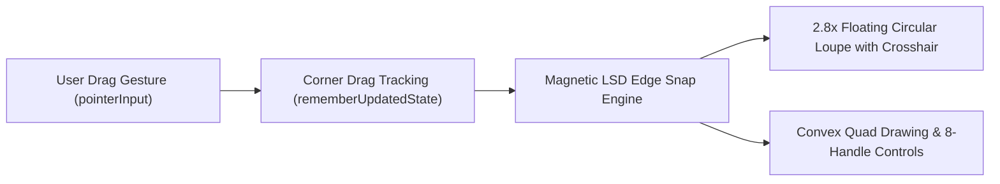

# Specification 03: Document Detection & Interactive Cropping
## 技术规格书 03：文档边缘检测与交互式裁剪规范

> **Document Status**: Authoritative Subsystem Specification  
> **Consolidates**: Legacy SPEC_05 (Interactive Crop), SPEC_06 (LSD Magnetic Snapping), and SPEC_15 (Wide-Aspect & Text Saliency)  
> **Target Audience**: Computer Vision & Interaction Engineers  
> **Languages**: Primary: English / Secondary: Chinese (Bilingual Executive Summaries)

---

## 1. Overview / 概述

The detection and cropping pipeline locates physical document boundaries in live viewfinder streams, guides user alignment, and provides pixel-perfect corner editing via magnetic snapping and a 2.8× floating loupe.

---

## 2. Real-Time Viewfinder Edge Detection / 实时取景边缘检测

### 2.1 Y-Channel Downsampling & Gradient Field
Preview frames arrive in `YUV_420_888` at $1280 \times 960$. To achieve $\ge 40\,\text{FPS}$ processing on the background analysis thread:
1. The single-channel luma ($Y$) plane is extracted and downsampled to width $w_{\text{small}} = 480$.
2. Horizontal and vertical Sobel kernels compute the gradient magnitude:
   $$\text{gradMag}(x, y) = |\text{Sobel}_x(I)| + |\text{Sobel}_y(I)|$$
3. A 64-bit integral image $S_{\text{grad}}(X, Y)$ is computed for $O(1)$ regional energy queries:
   $$S_{\text{grad}}(X, Y) = \sum_{x \le X, y \le Y} \text{gradMag}(x, y)$$

### 2.2 Aspect Ratio Tolerance up to 12:1
Traditional document scanners clamp bounding box aspect ratios to $\le 5.0$, discarding long banners, train platform signs, or narrow receipts. HachiCam extends the valid range:
$$\text{Aspect Ratio} = \frac{\max(W, H)}{\min(W, H)} \le 12.0$$
Rectangularity threshold is relaxed to $\ge 0.65$ to tolerate trapezoidal perspective skew from high/low oblique capture angles.

### 2.3 Text Saliency Stroke Energy Density
To prevent blank glass windows or high-contrast subway train doors from triggering false positives over legitimate informational signs:
1. The candidate polygon's bounding box is contracted by a $12\%$ inner margin ($R_{\text{inner}}$) to exclude border contrast:
   $$\text{SumGrad} = S_{\text{grad}}(x_2, y_2) - S_{\text{grad}}(x_1, y_2) - S_{\text{grad}}(x_2, y_1) + S_{\text{grad}}(x_1, y_1)$$
   $$\text{MeanGrad} = \frac{\text{SumGrad}}{\text{Area}(R_{\text{inner}})}$$
2. **Saliency Weight Gain ($W_{\text{saliency}}$)**:
   - Blank reflective glass: $\text{MeanGrad} < 3.0 \implies W_{\text{saliency}} \approx 1.0$.
   - High-density text sign: $\text{MeanGrad} \in [15.0, 50.0] \implies W_{\text{saliency}} \in [2.5, 4.0]$.
   $$W_{\text{saliency}} = 1.0 + 3.0 \cdot \text{clamp}\left(\frac{\text{MeanGrad} - 3.5}{16.0}, 0.0, 1.0\right)$$

### 2.4 Composite Multi-Objective Scoring Function
Candidates are sorted descending by composite score:
$$\text{Score} = \text{Rectangularity} \times \text{CenterBias} \times (\sqrt{\text{AreaRatio}} + 0.18) \times W_{\text{saliency}} \times W_{\text{touch}}$$
Where $W_{\text{touch}} = 3.0$ if the user tapped inside the candidate polygon, and $1.0$ otherwise.

### 2.5 IIR Temporal Corner Smoothing
Detected corners $P_t$ are stabilized across frames using an Infinite Impulse Response (IIR) filter:
$$\hat{P}_t = \gamma P_t + (1 - \gamma) \hat{P}_{t-1}, \quad \gamma = 0.65$$
Eliminates high-frequency preview jitter while remaining responsive to rapid device panning.

---

## 3. Structural Line Segment Detection (LSD) Magnetic Snapping / 结构化线段磁吸

During manual quad adjustment on the crop screen:
1. **LSD Feature Extraction**:
   On the high-resolution captured photo, `cv::createLineSegmentDetector()` extracts physical document edges within a 150 dp region of interest around the user's touch finger.
2. **Attraction Zone**:
   If a dragged corner $P_{\text{touch}}$ approaches a detected line segment $L = (A, B)$ within radius $r_{\text{snap}} \le 36\,\text{dp}$:
   $$d = \frac{|(B_y - A_y)x_0 - (B_x - A_x)y_0 + B_x A_y - B_y A_x|}{\|B - A\|}$$
3. **Corner Intersection Solving**:
   When two adjacent edges intersect near the corner, the corner point is magnetically locked to the exact geometric intersection:
   $$P_{\text{snapped}} = L_{\text{horizontal}} \cap L_{\text{vertical}}$$
   Haptic feedback (`HapticFeedbackType.LongPress`) fires upon snap engagement.

---

## 4. Interactive QuadCropView with 2.8× Loupe / 交互式放大镜与四边形裁剪

### 4.1 Gesture Stability Contract
- The drag gesture uses `.pointerInput(bitmap)` with `rememberUpdatedState` for corners, eliminating touch cancellation and recomposition stutter.
- Operates at continuous 60 FPS on the Compose main thread.

### 4.2 Floating Magnifying Loupe
- When any corner or midpoint is dragged, a circular $2.8\times$ magnified loupe appears offset $72\,\text{dp}$ above the touch point to prevent finger occlusion.
- Displays a high-contrast crosshair (Teal `#008080` center with white outer rim) for sub-pixel boundary positioning.
