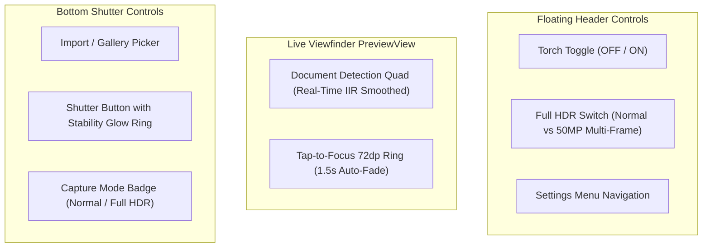

# Specification 05: Hachimi Design System & User Experience
## 技术规格书 05：Hachimi 设计系统与交互规范

> **Document Status**: Authoritative UI/UX Specification  
> **Consolidates**: Legacy SPEC_07 (Hachimi Design System)  
> **Target Audience**: UI/UX Designers & Mobile Frontend Engineers  
> **Languages**: Primary: English / Secondary: Chinese (Bilingual Executive Summaries)

---

## 1. Visual Identity & Brand Philosophy / 视觉识别与品牌设计

The Hachimi Design System combines professional optical instrument aesthetics with modern Jetpack Compose Material 3 principles. It prioritizes dark-mode contrast, unobtrusive camera overlays, and instantaneous tactile feedback.

---

## 2. Design Tokens & Color System / 颜色令牌规范

| Token Name | Hex Code | Color Swatch | Role & Application Context |
|:---|:---:|:---:|:---|
| **`PrimaryTeal`** | `#008080` | `■` | Primary brand accent; active crop handles, crosshairs, primary action buttons |
| **`CherryPink`** | `#FFB7C5` | `■` | Secondary brand tone; stability ring pulses, celebratory capture animations |
| **`AmoledBackground`**| `#121212` | `■` | True-dark background minimizing battery consumption on OLED displays |
| **`SurfaceDark`** | `#1E1E1E` | `■` | Surface level 1: Cards, bottom action sheets, top navigation bars |
| **`SurfaceElevated`** | `#2A2A2A` | `■` | Surface level 2: Dialog modals, floating loupe background border |
| **`StabilityGreen`** | `#4CAF50` | `■` | Viewfinder stability indicator ring when frame variance $\sigma \le 3.5\,\text{px}$ |
| **`TextPrimary`** | `#F5F5F5` | `■` | High-emphasis typography (87% luminance) |
| **`TextSecondary`** | `#9E9E9E` | `■` | Medium-emphasis captions, metadata labels, EXIF tags (60% luminance) |

---

## 3. Viewfinder Interface Architecture / 取景界面结构

### 3.1 Full HDR Mode Switch Contract
- Switching to Full HDR displays a one-time informative confirmation dialog explaining the 4-frame exposure pipeline (~500ms processing delay).
- When enabled, a glowing badge displays `[Full HDR]` above the shutter button.

### 3.2 Tap-to-Focus Visual Ring
- Size: $72 \times 72\,\text{dp}$.
- Border: $1.5\,\text{dp}$ solid white with rounded corners ($8\,\text{dp}$ radius).
- Entry Animation: Scales smoothly from $1.2\times$ to $1.0\times$ over $150\,\text{ms}$ with `FastOutSlowInEasing`.
- Auto-Dismiss: Fades out after $1500\,\text{ms}$.

---

## 4. Document Review & Filter Pipeline UI / 文档预览与滤镜交互

### 4.1 Filter Carousel Bottom Sheet
- Provides one-tap switching between:
  1. **Original**: Unfiltered color with geometry correction.
  2. **Magic Color**: CIE-Lab Retinex illumination normalization (default for documents).
  3. **Black & White**: Sauvola adaptive binarization for clean high-contrast text.
  4. **Grayscale**: 8-bit luma gradient with contrast stretch.
  5. **Photo**: Photographic tone preservation for colored artwork.
- Thumbnails are pre-rendered asynchronously to guarantee 60 FPS horizontal scrolling.

### 4.2 Multi-Page Document Management
- Drag-and-drop page reordering with animated elevation changes.
- Batch PDF export with quality slider and instant Android system share sheet dispatch.
