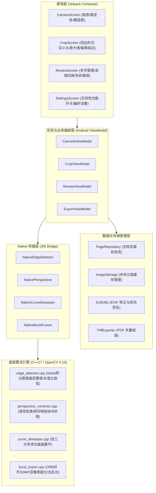

# 技术规格书 00：系统整体架构与技术栈全景 (System Architecture & Tech Stack)

> **文档性质**：基础架构与工程全景规范说明书 (Foundational System Specification)  
> **制定目标**：梳理 HachiCam 当前完整技术栈、模块分层、数据流管线，客观剖析“为何自研底层算法（不依赖 GMS）”的技术立项考量，并公开记录当前存在的架构缺陷与重构演进路线。

---

## 1. 系统设计理念与定位 (Design Philosophy & Goals)

HachiCam 是一款**纯本地运行、零网络依赖、基于经典计算机视觉算法的 Android 文档扫描仪**。项目由个人开发者与 AI 结对编写，作为移动端低层计算摄影与相机调优的实验性探索。

### 核心设计原则
1. **100% 本地运算与隐私安全**：
   - 清单中不申请 `android.permission.INTERNET`，在操作系统层物理断绝数据外传风险。
   - 所有边缘检测、单应性变换、多帧融合、滤波二值化与 PDF 生成全部在设备本地完成。
2. **纯粹自由开源与零 GMS 依赖 (FOSS & De-Googled Friendly)**：
   - 彻底摆脱对 Google Play Services（如 ML Kit Document Scanner）等专有私有库的依赖。
   - 保证在 LineageOS、GrapheneOS、CalyxOS 等无 GMS 环境的开源 ROM 及海外/国内无 Play 服务的设备上 100% 完整运行。
3. **算法确定性与数学可解释性**：
   - 放弃不可控、易产生文字笔画幻觉（Hallucination）的大模型端侧黑盒生成，基于经典图像处理理论（Retinex 照度分解、Sauvola 局部二值化、ORB/RANSAC 亚像素几何对齐、Mertens 曝光融合、手部微抖动亚像素超分辨率）实现精准复原。

---

## 2. 技术栈清单 (Technology Stack Matrix)

| 层次 / 维度 | 选用技术 / 库 | 版本 | 选型理由与职责 |
| :--- | :--- | :--- | :--- |
| **操作系统目标** | Android API Level | minSdk 29 (Android 10), targetSdk 35 | 面向现代 Android 架构，支持 Scoped Storage 与 Camera2 完备特性 |
| **编程语言** | Kotlin / C++17 | Kotlin 2.0 / Clang C++17 | 顶层采用现代化现代类型安全语言，底层运算采用高性能本地原生编译 |
| **UI 框架** | Jetpack Compose / Material 3 | Compose 1.7+ (BOM 2024.09) | 纯声明式 UI，实现 60FPS 触摸手柄吸附、放大镜取景与屏幕旋转过渡 |
| **相机子系统** | CameraX + Camera2Interop | CameraX 1.4.x | 利用 CameraX 管理相机生命周期与用例绑定，通过 `Camera2Interop` 注入硬件级 ISP 调优参数（高画质边缘、降噪、色调映射、OIS） |
| **核心算法引擎** | OpenCV C++ Native Core | OpenCV 4.10.0 (Native NDK) | 规避 Java JNI 内存翻倍开销，纯 C++ 实现多通道矩阵运算、积分图加速与特征匹配 |
| **构建系统** | Gradle + CMake | Gradle 8.14 + CMake 3.22.1 | 统一管理 NDK 原生库编译与 Android 多 Flavor 构建 |
| **导出引擎** | Android Native `PdfDocument` | Android Framework | 零第三方臃肿库依赖，极速输出符合印刷标准的矢量页面与 PDF 文档 |
| **EXIF 处理** | AndroidX ExifInterface | 1.3.7 | 物理级矫正旋转朝向，嵌入文档 Provenance 签名元数据 |

---

## 3. 分层系统架构 (System Architecture)

---

## 4. 关键数据流管线 (Core Data Pipelines)

### 4.1 实时取景边缘检测管线 (Preview Analysis Pipeline)
1. `CameraX ImageAnalysis` 接收 YUV_420_888 预览流帧（目标分辨率 $1280 \times 960$）；
2. 提取 Y 通道单通道灰度数据并根据传感器朝向就地旋转；
3. 原生 C++ 接收图像指针：
   - 降采样并构建 Sobel 梯度幅值积分图（Integral Image）；
   - Canny 边缘检测 + 轮廓提取 + 多边形逼近；
   - 综合几何矩形度、画面中心度、长宽比（支持 $12:1$ 长横幅）及**内部文字笔画能量密度（Text Saliency）**计算候选评分；
4. 输出规整的 4 角点坐标并经过 IIR 时域平滑滤波，驱动 Compose `EdgeOverlay` 绘制取景参考线与稳定性指示灯。

### 4.2 拍摄与超分连拍管线 (Capture & Super-Res Pipeline)
* **单帧直出模式**：
  - Camera2 强制注入 `EDGE_MODE_HIGH_QUALITY`、`NOISE_REDUCTION_HIGH_QUALITY`、`LENS_OPTICAL_STABILIZATION_ON`；
  - 触发最高解析度拍摄，物理旋转归一化 JPEG EXIF 为正向，锁定检测四边形。
* **50MP 多帧超分辨率连拍模式（实验性）**：
  - 当手持稳定性检测达标时，连续捕获 3~4 帧微抖动短曝光原始图像；
  - C++ 层提取 ORB 关键点，计算亚像素精度单应性矩阵 $H$；
  - 映射至 $2\times$ 放大画布（$8160 \times 6144 \approx 50.1\text{MP}$），根据双边光度差值计算时域像素权重，消除反光并重构高频边缘，施加亚像素反锐化掩模。

### 4.3 透视矫正与滤镜处理管线 (Dewarp & Filter Pipeline)
1. **透视变换**：根据 4 角点映射到目标物理尺寸（A4/A3/自定义等），自动估算相机俯仰倾角并补偿透视缩短；
2. **色彩与二值化滤波**：
   - **Retinex Magic Color**：转换至 CIE-Lab 空间，提取 L 通道低频照度场并执行除法运算消除阴影折痕，结合双边自适应白平衡还原纸张底色；
   - **Sauvola 局部二值化**：通过积分图实现 $O(1)$ 局部动态均值与方差计算，抗复印暗底；
   - **平滑灰度**：宽动态对比度拉伸。

---

## 5. 针对外部质疑与立项必要性的客观说明 (Addressing Criticisms)

### 5.1 针对“为何不直接用系统/现成轮子（如 ML Kit）”的解答
1. **完全开源协议与去 Google 化 (De-Googled) 需求**：
   - Google ML Kit Document Scanner 依赖封闭私有的 Google Play Services (GMS) 动态分发。
   - 在开源第三方 ROM（LineageOS、GrapheneOS 等无 GMS 环境）及全球多个无 Play 服务的地区，该方案会直接抛出运行异常或静默失效。
2. **算法透明度与底层 ISP 控制权**：
   - 商业/专有 SDK 屏蔽了所有拍摄参数，无法干预多帧包围曝光时长、无法关闭有损后处理压缩、无法定制亚像素去反光与几何缩短补偿。
   - 自建 OpenCV + Camera2 管线使整个计算摄影链路清晰透明、可审计、可精确调优。

### 5.2 诚实面对代码现状：已知架构缺陷与技术债务 (Tech Debt Audit)
客观而言，项目在前期敏捷原型开发与结对生成过程中，积累了较为明显的工程债务（也是外界提出批评的技术事实）：

1. **磁盘文件 I/O 往返开销严重 (File I/O Bottlenecks)**：
   - *当前现状*：CameraX 拍照保存为磁盘 JPEG 文件 $\to$ C++ 调用 `imread` 重新解码为 Mat $\to$ 算法处理 $\to$ `imwrite` 存盘 $\to$ 上层加载为 Bitmap。
   - *缺陷*：引入了不必要的磁盘 I/O 延迟与多次 JPEG 有损重编码损耗。
   - *未来重构方案*：改造为基于 `ImageProxy` / `HardwareBuffer` 的零拷贝内存共享管线，直接在内存中传递 RGBA/YUV 缓冲区。
2. **大单体文件 (Monolithic Components)**：
   - *当前现状*：`CameraScreen.kt` 与 `CameraViewModel.kt` 代码行数较多，混合了传感器生命周期、CameraX 绑定、UI 动效与业务路由。
   - *未来重构方案*：解耦为 `CameraLifecycleManager`、`OrientationTracker`、`CaptureUseCase` 等轻量级单一职责模块。
3. **缺少持久化数据库支撑**：
   - *当前现状*：`PageRepository` 仅依赖内存中的 StateFlow 数组管理，若在未导出前发生内存不足杀后台（Process Death），已扫描页面会丢失。
   - *未来重构方案*：引入 AndroidX Room SQLite 本地轻量级持久化。
4. **JNI 原生指针与类型安全**：
   - *当前现状*：JNI 层较多传递裸指针地址（`jlong matAddr`）与扁平 `FloatArray`，缺少严格的 C++ 异常安全 RAII 封装与类型包装。

---

## 6. 后续重构与演进路线 (Refactoring Roadmap)

- [ ] **Phase 1: 内存零拷贝改造**：消除拍照至 Native 算法之间的磁盘文件缓存往返，统一内存 Buffer 传递。
- [ ] **Phase 2: 架构分层解耦**：重构 `CameraViewModel` 与 `CameraScreen`，推行纯正的 MVI / Clean Architecture 架构。
- [ ] **Phase 3: 引入 Room 状态持久化**：防止因后台回收导致临时扫描批次丢失。
- [ ] **Phase 4: 算法基准评估集 (Benchmark Suite)**：建立基于公开文档扫描数据集的定量评估体系，优化边缘检测准确率与能耗指标。
